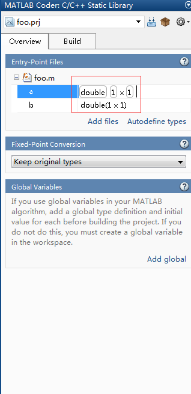

[使用MATLAB Coder从MATLAB生成C/C++代码](http://blog.csdn.net/fengbingchun/article/details/6793826)

1、安装matlab2013a或者更新版本；

2、以简单一个简单的例子，两数相乘。生成一个foo.m文件；

```matlab
function c = foo(a, b)%#codegen

%This function muliplies a and b

c = a * b
end
```

其中，%#codegen可以防止出现警告错误

3、在命令窗口，输入`mex -setup`,选中一个存在的编译器；

4、在命令窗口输入`coder`(图形界面)，回车，弹出MATLAB Coder Project对话框；

5、在New选项卡Name中输入一个工程名foo.prj；点击Ok，弹出MATLAB Coder MEX Function对话框；

6、在Overview选项卡中，点击Add files，弹出对话框，选中foo.m打开；

7、单击变量a,选择Define by Example…,弹出MATLAB Coder Define by Example对话框，设置变量的类型。函数所传递的参数的类型和维数是必须确定的。



8、选中Build选项卡，Output type中选择c/c++ Static Library；选中Generate code only；

9、点击More settings，Generalate Language选择C++；Close；

10、点击Build，进行编译；点击View report，弹出Code Generation Report对话框，此时，变量a、b、c会显示相应的变量信息；

11、利用vs2008建立一个控制台应用程序，将生成的相关文件.h头文件和.cpp文件拷到相关目录下并添加到应用程序中；

实际转化复杂一点的函数时有可能出错

例如matlab存在以下代码：

```c++
 %解方程T1^3+2*V_start*T1/J-L/J=0得到T1
 %V_end2=V_start+J*T1^2
a=1;
b=0;
c=2*V_start/J;
d=-L/J;
x=roots([a b c d]);
T1=x(abs(imag(x))<1e-6);
T3=T1;
%时刻定义
time1=0:T:T1;
```

当Matlab函数的代码中存在time=0：T：T1；其中T是传进来的参数，T1是根据传进来的几个参数计算得到的。这样的代码有可能会出错，提示colon operand must be a real scalar.（冒号操作数必须是实数标量。）。

这里T1这个变量的维数以及是否是实数是不确定的。但是在`time1=0:T:T1;`语句中的冒号的操作数必须是实数标量。因此这样的代码需要确定T1是实数的标量。

12、在foo.cpp文件中添加#include “stdafx.h”；如果转化生成很多的.cpp文件，那么需要在所有的.cpp文件中添加#include “stdafx.h”。

13、test.cpp文件中代码为：

```c++
#include "stdafx.h"
#include "foo.h"
#include <iostream>
using namespace std;
int _tmain(int argc, _TCHAR* argv[])
{
    double a = 0.0, b = 0.0, c = 0.0;
    cin>>a>>b;
    c = foo(a, b);
    cout<<"c = "<<c<<endl;
    return 0;
}
```


--------

参考资料

[举例说明使用MATLAB Coder从MATLAB生成C/C++代码步骤](http://blog.csdn.net/fengbingchun/article/details/6793826)