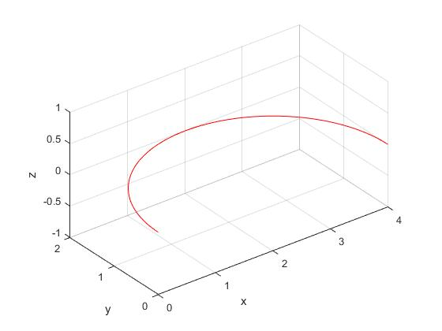

# matlab根据给定3点画圆弧


## 简介

matlab根据给定3点坐标画圆弧

## 实现原理看代码及注释

```matlab
%arcPlot.m
function arcPlot(pos,colour)
%功能：
%根据给定3点绘制圆弧
%参数：
%pos，给定的坐标点例如pos=[0 0 0;2 2 0;4 0 0];
%colour,指定线条颜色，例如colour='r';

hold on
p1=pos(1,:);
p2=pos(2,:);
p3=pos(3,:);
%求半径和圆心坐标
p1p2=p2-p1;
u1=unitVec(p1p2);%自定义函数，对向量单位化

p2p3=p3-p2;
u2=unitVec(p2p3);

normal=cross(p1p2,p2p3);%matlab自带的内部函数，求向量叉积
normal=unitVec(normal);

per2=cross(normal,u2);
per2=unitVec(per2);

mid1=(p1+p2)/2;
mid2=(p2+p3)/2;
dis2=sqrt(sum(p2p3.^2));
L=(vecDot(mid1,u1)-vecDot(mid2,u1))/vecDot(per2,u1);

arc_R=sqrt(L^2+1.0/4*dis2^2);

C=mid2+L*per2;

%求圆心角
vec1=p1-C;
vec1=unitVec(vec1);
vec2=p3-C;
vec2=unitVec(vec2);
theta=vecDot(vec1,vec2);
normal2=cross(vec1,vec2);
theta=acos(theta);
if(sqrt(sum((normal-normal2).^2))>1.0e-5)
    theta=2*pi-theta;
end

if(sqrt(sum((normal-normal2).^2))>1.0e-5)
    theta=2*pi-theta;
end
%计算数据点
%圆弧的局部坐标系单位向量
vx=[1,0,0];
vy=[0,1,0];
vz=[0,0,1];
v1=vec1;
v3=normal;
v2=cross(v3,v1);
v2=unitVec(v2);
%求变换矩阵
r11=vecDot(v1,vx);r12=vecDot(v2,vx);r13=vecDot(v3,vx);
r21=vecDot(v1,vy);r22=vecDot(v2,vy);r23=vecDot(v3,vy);
r31=vecDot(v1,vz);r32=vecDot(v2,vz);r33=vecDot(v3,vz);
Tr=[r11,r12,r13,0;
    r21,r22,r23,0;
    r31,r32,r33,0;
    0,0,0,1];
Tt=[1,0,0,C(1);
    0,1,0,C(2);
    0,0,1,C(3);
    0,0,0,1];
%局部坐标系数据点的坐标
t=0:(theta)/100:theta;
x1=arc_R*cos(t);
y1=arc_R*sin(t);
z1=t*0;
pt=[x1;y1;z1;ones(size(x1))];
%局部坐标表达变换到基坐标表达
pt=Tt*Tr*pt;

plot3(pt(1,:),pt(2,:),pt(3,:),colour);
xlabel('x')
ylabel('y')
zlabel('z')

view(-37.5,30)
hold on
grid on
axis equal
end
```

自定义函数vecDot()

```matlab
%求两个向量的点积
function z=vecDot(x,y)
z=sum(x.*y);
```

自定义函数unitVec()

```matlab
%自定义函数，对向量单位化
function vector=unitVec(vec)
vector=vec/sqrt(sum(vec.^2));
end
```


## 测试例子

```matlab
pos=[0 0 0;2 2 0;4 0 0];
arcPlot(pos,'r');%调用圆弧绘制函数
```

结果如下：



## 结束语

祝您生活愉快！