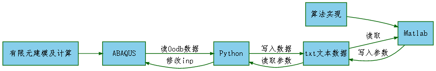

# Matlab-python-ABAQUS数据交互及联合使用

在Matlab可以方便地实现各种优化算法，ABAQUS可以方便地进行有限元建模及求解，有时候两者结合可以更方便做一些自己想做的事，例如通过遗传算法，神经网络等算法进行参数反演，确定本构模型的参数。ABAQUS/CAE的内核语言是Python，通过Python可以方便地读取ABAQUS的结果数据库odb的数据。这里介绍一些关于如何进行三者的交互，编写交互的方法与经验。



## 通过matlab提交inp文件给ABAQUS计算

可以在matlab里面直接通过系统调用向ABAQUS提交计算文件及相关计算参数，包括用户子程序，cpu数量等。下面是一个函数接口。

接口函数例子：

```matlab
%runabaqus.m
%向abaqus提交计算文件
%libing403，2017-05-07
function [ output_args ] = runabaqus(Path,userFile,InpFile,cpus)
%runabaqus Summary of this function goes here
%ABAQUS提交计算的命令，inp文件，用户子程序，cpus数目等
inputFile=['abaqus job=',InpFile,' user=',userFile,' cpus=',cpus];
t0=tic;%开始计时
MatlabPath=pwd();%记下当前Matlab目录，
cd(Path);%进入Abaqus目录，即inp文件所在目录
[ output_args ] =system(inputFile);%通过系统调用，运行ABAQUS，提交计算文件
pause(5)
cd(MatlabPath);%返回Matlab工作目录
if (exist([Path,'\',InpFile,'.lck'],'file')==2)
    %若提交成功，则检测计算时间
  while exist([Path,'\',InpFile,'.lck'],'file')==2
       t=toc(t0);
       h=fix(t/3600);
       m=fix(mod(t,3600)/60);
       sec=fix(mod(mod(t,3600),60));
       pause(1)
       fprintf('----------ABAQUS calculating----------\n           time costed  %d:%d:%d\n',...
       h,m,sec);
  end
  fprintf('----------ABAQUS complete----------\n           time costed  %d:%d:%d\n',...
    h,m,sec);
else
    %若提交计算出错，则输出错误信息
    fprintf('\n runabaqus erro:InpFile submmit failed\n')
end
end
```

其实只需一条命令，`system(abaqus job=Inpfile )`就可以完成提交计算文件，其他都是辅助，使接口函数适用性更好，把实现方法封装起来。有了接口函数，在matlab定义好相关参数，调用接口就行。

应用例子：

```matlab
%操作ABAQUS，监测计算流程
%libing403，2017-5-6
clc
clear
%inp 文件
InpFile='unixial-inversion-per';%不需要后缀名inp
userFile='usfeld';%用户子程序
cpus='1';%计算使用的cpu个数
runabaqus(Path,userFile,InpFile,cpus);%运行abaqus进行计算
```

## matlab利用python脚本读取odb数据

思路是：matlab把读取数据的要求写入个txt文件（这里是req.txt），调用python脚本，python脚本读取odb的结果数据，并写入另一个txt文件(这里是RF3.txt)，matlab再从txt文件读取数据。首先编写python接口函数，实现从odb提取特定的结果数据。

例子：读取一个参考点的反力RF3

```python
#! /user/bin/python
#- -coding: UTF-8-*-
#odbHistoyOutput.py
# 本脚本的功能是按照req.txt文件指定的要求，读取输出数据库 *.odb的历史数据
#libing403，2017-5-7
#导入abaqus odbAcess模块
from odbAccess import *
import time
#获取matlab指定的数据库，部件名，节点，特定结果的信息
f=open('req.txt','r')
req=f.readline()
f.close()
req=req.split(',')
path=req[0]+'/'+req[1]
step=req[2]
instance=req[3]
node_set=req[4]
ReqData=req[5]
#输出提示信息
fmeg=open('pylog.txt','w')
meg='------------------------------------------------------------------\n'
meg=meg+'odb_HistoryOutput message:\n'
meg=meg+time.strftime('%Y-%m-%d %H:%M:%S',time.localtime(time.time()))+'\n'
meg=meg+'read '+node_set+' '+ReqData+' from \n'+path
print meg
fmeg.write('%s\n'%meg)
#打开odb数据库
odb = openOdb(path=path)
#输出提示信息
meg='open odb successfully\n'
fmeg.write('%s'%meg)
print meg
#创建变量表示第n个分析步
step_n=odb.steps[step]
# 创建变量表示第1个分析步的最后一帧
lastFrame = step_n.frames[-1]
#获取历史输出区域
region =step_n.historyRegions[node_set]
#输出提示信息
meg='get nodes sets successfully\n'
fmeg.write('%s'%meg)
print meg
# 获取结果
GetData=region.historyOutputs[ReqData].data
DataFile=open(ReqData+'.txt','w')
for time,Data in GetData:
    DataFile.write('%10.4E  %10.4E\n'%(time,Data))
DataFile.close()

#输出提示信息
meg='get data  successfully\n'
fmeg.write('%s'%meg)
print meg
fmeg.close()
```

这个脚本主要是读取ABAQUS历史输出数据，读取场输出数据可以进行修改实现。

有了python脚本就可以在matlab里调用它来读取ABAQUS的结果数据。当然在matlab里要指定odb文件名，部件名，节点名称等信息，为了把实现封装起来，也把调用python脚本的matlab程序写成一个函数get_history_output。

调用python脚本的matlab函数：

```matlab
%get_history_output.m
%运行python脚本，读取odb数据库的历史输出
%libing403，2017-05-07
function get_history_output(Path,OdbFile,step,req)
% %specified part instance,node set,output
%参数写入Abaqus工作目录
ReqFile=[Path,'\req.txt'];
fid=fopen(ReqFile,'wt');
fprintf(fid,'%s,%s,%s,%s',Path,OdbFile,step,req);
fclose(fid);
%写入当前目录
ReqFile='req.txt';
fid=fopen(ReqFile,'wt');
fprintf(fid,'%s,%s,%s,%s',Path,OdbFile,step,req);
fclose(fid);
%execute python file
system('abaqus cae noGUI=odbHistoryOutput.py');%调用python脚本
showlogfile('pylog.txt');%显示python运行的输出信息
end
```

这里的参数(Path,OdbFile,step,req)是读取odb结果需要的，先把它们写入到req.txt文件，供上面的python脚本odbHistoyOutput.py读取。其中showlogfile函数显示python运行时输出的信息，这些信息保存在pylog.txt文件中。该函数的实现在另一篇博客[Matlab目录操作及fgetl函数](http://blog.csdn.net/libing403/article/details/71403025)已经介绍。

那么在matlab里就可以指定odb相关信息，调用上面的函数来get_history_output获得odb数据。

应用例子：

```matlab
%example.m
%libing403，2017-05-07
%specified part instance,node set,output
req='PLATEN-1,Node PLATEN-1.5322,RF3';%指变req='PLATEN-1,Node PLATEN-1.5322,RF3';%指定部件名，节点名和读取的结果
step='Step-1';%指定读取的分析步
Path='F:\security folder\ABAQUS WORKING\inversion_per';%指定odb所在目录
OdbFile='unixial-inversion-per.odb';%指定odb文件名
%调用函数，读取odb数据
get_history_output(Path,OdbFile,step,req);
```

## 小结

这里matlab与python脚本之间可能有比较的参数和数据需要传递，因此，我这里先把要传递的参数和数据写入特定的txt文件，然后再由另一程序去读取。其次是这里尽量把每个简单的功能写成函数，这样有助于更容易调试程序，不断添加新功能和集成。这就是增量式开发的思想。