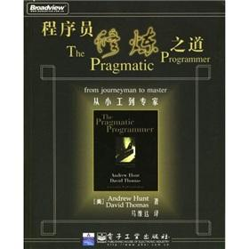

# 《程序员修炼之道–从小工到专家》的读书笔记

《程序员修炼之道–从小工到专家》[美]Andrew Hunt / David Thomas 著 马维达 译

*图片来源-[百度图片](https://image.baidu.com/search/detail?ct=503316480&z=0&ipn=d&word=%E7%A8%8B%E5%BA%8F%E5%91%98%E4%BF%AE%E7%82%BC%E4%B9%8B%E9%81%93&step_word=&hs=0&pn=2&spn=0&di=53557249350&pi=0&rn=1&tn=baiduimagedetail&is=0%2C0&istype=0&ie=utf-8&oe=utf-8&in=&cl=2&lm=-1&st=undefined&cs=250462743%2C2808477446&os=1725353761%2C3859335782&simid=3514005565%2C331277626&adpicid=0&lpn=0&ln=589&fr=&fmq=1496125189893_R&fm=&ic=undefined&s=undefined&se=&sme=&tab=0&width=undefined&height=undefined&face=undefined&ist=&jit=&cg=&bdtype=0&oriquery=&objurl=http%3A%2F%2Fs9.knowsky.com%2Fbk%2F2012%2F201206030828208123.jpg&fromurl=ippr_z2C%24qAzdH3FAzdH3Fk55h_z%26e3Bhg5ofhy_z%26e3Bv54AzdH3Fk55h_99a_z%26e3Bip4&gsm=0&rpstart=0&rpnum=0)*

看这本书主要使用了检视阅读中略读的方法，大体了解本书所讲的主要内容。

## (1)整体来说，这本书到底在谈些什么？

本书围绕“注重实效”讲述了关于编程的各种话题，个人责任、拽光弹开发、调试策略、元程序设计、按合约设计、重构、无情的测试，等等。作者认为注重实效的程序员的特征是程序员在处理问题、寻找解决方案时的态度、风格、哲学，他们能够超越直接的问题去思考，总是设法把问题放在更大的语境中，总是设法注意更大的图景。

## (2)作者细部说了什么，怎么说的？

作者在短短的300多页的一书中论述的内容非常多，共8章，论述了程序员如何实现“注重实效”。作者论述的逻辑一般是首先解释所提及主题打关键概念，在论述每个小主题时，作者通常（不是所有）列出一个相关的名言警句。例如谈到“需求之坑”时，有“完美，不是在没有什么需要增加，而是在没有什么需要去掉时达到的--Antoine de St.Exupery, Wind, Ssand, and Stars. 1939”。作者会在文中特别给出一些提示，帮助你更好掌握作者的思路，然后会给出一些目标（即建议）指导你怎么在工作中实践作者所提的观点或解决存在的问题。

在书的最后，作者总结出书中的提示和检查清单，在索引“注重实效的程序员之快速参考指南”列出。很容易去查找，看这些就可以复习书中方法和观点，很方便平时温故而知新。

## (3)这本书说的有道理吗？是全部有道理，还是部分有道理？

书中很多方法对我来说是很有帮助的，我完全可以根据里面所说的一些建议进行实践，提高自己的编程能力。书本里直接列出了一些提示，目标和挑战，这都是可以直接实践的。例如在注重实效的哲学谈到了定期为你的知识资产投资，列出了这几个目标：

- 每年至少学习一种新语言。持续投入十分重要，一旦你熟悉了某种语言或新技术，继续前进，学习另一种。
- 每季度阅读一本技术书籍。
- 也要阅读非技术书籍。
- 上课。在本地的学院或大学、或是将要来临的下一次会展上寻找有趣的课程。
- 参加本地用户组织。
- 试验不同的环境。
- 跟上潮流。
- 上网。想要了解某种新语言或其他技术的各种特性？要了解其他的相关经验，了解他们使用的特定行话，等等，新闻组是很好的方式，上网冲冲浪，查找论文、商页站点、以及其他任何你可以找到的信息来源。

由于我缺乏实践经验，很难鉴别书中所论述的一些我不熟悉的方法是否有效。在今后的工作实践中再来领悟肯定有新的收获。

## (4)这本书跟你有什么关系？

即将毕业，我很快将会开始我的程序员生涯，作为编程初学者，我可以书中了解到各种编程技术和方法，根据书中的指引拓展我的编程生涯。

## 文档生成工具

阅读这本书了解到了写程序文档也是很重要的，介绍了文本操纵的很重要意义。里面提到了作者常用perl语言编写脚本来操纵文本，例如格式化书本、生成程序的HTML文档。我对此还是感到比较新奇，因为从未使用过这样的工具。去网上搜索了一下，果然搜出一大批文档生成工具，例如doxygen，找到两篇博客很好地介绍了相关的文档生成工具：

[告别手写 API文档生成工具推荐](http://www.csdn.net/article/2013-02-20/2814189-API_DOC_TOOLS)

[Doxygen给C程序生成注释文档](http://www.cnblogs.com/fkpj/p/4537145.html)

使用文档生成工具的好处是可以更快速的实现文档随代码的变化而自动个更新，免去很多反复修改文档的繁琐重复工作。

## 注重实效的程序员之快速参考指南

*图片来源-[百度图片](https://image.baidu.com/search/detail?ct=503316480&z=0&ipn=d&word=%E7%A8%8B%E5%BA%8F%E5%91%98&step_word=&hs=0&pn=5&spn=0&di=193678850420&pi=0&rn=1&tn=baiduimagedetail&is=0%2C0&istype=2&ie=utf-8&oe=utf-8&in=&cl=2&lm=-1&st=-1&cs=3246888480%2C524138677&os=1315022303%2C3967017515&simid=3351522755%2C155689870&adpicid=0&lpn=0&ln=1895&fr=&fmq=1496714082250_R&fm=result&ic=0&s=undefined&se=&sme=&tab=0&width=&height=&face=undefined&ist=&jit=&cg=&bdtype=0&oriquery=&objurl=http%3A%2F%2Fupload.sj998.com%2Farchives%2F2014%2F1210%2Fimage%2F14181800692541.jpg&fromurl=ippr_z2C%24qAzdH3FAzdH3Fjejgp_z%26e3Bf3llb_z%26e3Bv54AzdH3Fvwtzit1w5AzdH3F99l99b-d_z%26e3Bfip4s&gsm=0&rpstart=0&rpnum=0)*

在书的最后，作者总结出书中的提示和检查清单，在索引“注重实效的程序员之快速参考指南”列出。很容易去查找，看这些就可以复习书中方法和观点，很方便平时温故而知新。

**1.关心你的技艺  Care About Your Craft**
 如果你不在乎能否漂亮地开发出软件，你又为何要耗费生命去开发软件呢？

**2.思考！你的工作  Think! About Your Work**
 关掉自动驾驶仪，接管操作。不断地批评和评估你的工作。

**3．提供各种选择，不要找蹩脚的借口  Provide Options, Don't Make Lame Excuses**
要提供各种选择，而不是找借口。不要说事情做不到；说明能够做什么。

**4.不要容忍破窗户  Don't Live with Broken Windows**
当你看到糟糕的设计、错误的决策和糟糕的代码时，修正它们。

**5.做变化的催化剂  Be a Catalyst for Change**
你不能强迫人们改变。相反，要向他们展示未来可能会怎样，并帮助他们参与对未来的创造。

**6.记住大图景  Remember the Big Picture**
不要太过专注于细节，以至忘了查看你周围正在发生什么。

**7.使质量成为需求问题  Make Quality a Requirements lssue**
让你的用户参与确定项目真正的质量需求。

**8.定期为你的知识资产投资  Invest Regularly in Your Knowledge Portfolio**
让学习成为习惯。

**9.批判地分析你读到的和听到的  Critically Analyze What You Read and Hear**
不要被供应商、媒体炒作、或教条左右。要依照你自己的看法和你的项目的情况去对信息进行分析。

**10.你说什么和你怎么说同样重要  It's both What You Say and the Way You Say it**
如果你不能有效地向他人传达你的了不起的想法，这些想法就毫无用处。

**11.不要重复你自己     DRY - Don't Repeat Yourself**
系统中的每一项知识都必须具有单一、无歧义、权威的表示。

**12.让复用变得容易     Make It Easy to Reuse**
如果复用很容易，人们就会去复用。创造一个支持复用的环境。

**13.消除无关事物之间的影响     Eliminate Effects Between Unrelated Things**
设计自足、独立、并具有单一、良好定义的目的的组件。

**14.不存在最终决策     There Are No Final Decisions**
没有决策是浇铸在石头上的。相反，要把每项决策都视为是写在沙滩上的，并为变化做好计划。

**15.用曳光弹找到目标     Use Tracer Bullets to Find the Target**

曳光弹能通过试验各种事物并检查它们离目标有多远来让你追踪目标。

**16.为了学习而制作原型     Prototype to Learn**
原型制作是一种学习经验。其价值并不在于所产生的代码，而在于所学到的经验教训。

**17.靠近问题领域编程     Program Close to the Problem domain**
用你的用户的语言进行设计和编码。

**18.估算，以避免发生意外     Estimate to Avoid Surprises     **

在着手之前先进行估算。你将提前发现潜在的问题。

**19.通过代码对进度表进行迭代     Iterate the Schedule with the Code     **

用你在进行实现时获得的经验提炼项目的时间标度。

**20.用纯文本保存知识     Keep Knowledge in Plain Text**
纯文本不会过时。它能够帮助你有效利用你的工作。并简化掉时和测试。

**21.利用命令shell的力量     Use the Power of Command Shells**
当图形用户界面无能为力时使用shell。

**22.用好一种编辑器     Use a Single Editor Well**
编辑器应该是你的手的延伸；确保你的编辑器是可配置、科扩展和可编程的。

**23.总是使用源码控制     Always Use Source Code Control**
源码控制是你的工作的时间机器--你能够回到过去。

**24.要修正问题，而不是发出指责     Fix the Problem, Not the Blame**
bug是你的过错还是别人的过错，并不是真的很有关系--它仍然是你的问题，它仍然需要
修正。

**25.调试时不要恐慌     Don't Panic When Debuging**
做一次深呼吸，思考什么可能是bug的原因。

**26.“Select”没有问题     "Select" Isn't Broken**
在OS或编译器、甚或是第三方产品或库中很少发现bug。bug很可能在应用中。

**27.不要假定，要证明     Don't Assume It - Prove It**
在实际环境中--使用真正的数据和辩解条件--证明你的假定。

**28.学习一种文本操纵语言     Learn a Text Manipulation Language**
你用每天的很大一部分时间处理文本，为什么不让计算机替你完成部分工作呢？

**29.编写能编写代码的代码     Write Code That Writes Code**
代码生成器能提高你的生产率，并有助于避免重复。

**30.你不可能写出完美的软件     You Can't Write Perfect Software**
软件不可能完美。保护你的代码和用户，使它（他）们免于能够预见的错误。

**31.通过合约进行设计     Design with Contracts**
使用合约建立文档，并检验代码所做的事情正好是它声明要做的。

**32.早崩溃     Crash Early**
死程序造成的危害通常比有问题的程序要小得多。

**33.用断言避免不可能发生的事情     Use Assertions to Prevent the Impossible**
断言验证你的各种假定。在一个不确定的世界里，用断言保护你的代码。

**34.将异常用于异常的问题     Use Exceptinos for Exceptional Problems**
异常可能会遭受经典的意大利面条式代码的所有可读性和可维护性问题的折磨。将异常保留给异常的事物。

**35.要有始有终     Finish What You Start**
只要可能，分配某资源的例程或对象也应该负责解除其分配。

**36.使模块之间的耦合减至最少     Minimize Coupling Between Modules**
通过编写“羞怯的”代码并应用得墨忒耳法则来避免耦合。

**37.要配置，不要集成     Configure, Don't Integrate**
要将应用的各种技术选择实现为配置选项，而不是通过集成或工程方法实现。

**38.将抽象放进代码，细节放进元数据     Put Abstractions in Code, Details in Metadata**
为一般情况编程，将细节放在被编译的代码库之外。

**39.分析工作流，以改善并发性     Analyze Workflow to Imporve Concurrency**
利用你的用户的工作流中的并发性。

**40.用服务进行设计     Design Using Services**
根据服务--独立的、在良好定义、一致的接口之后的兵法对象--进行设计。

**41.总是为并发进行设计     Always Design for Concurrency     **

容许并发，你将会设计出更整洁、具有更少假定的接口。

**42.使视图与模型分离     Separate Views from Models     **

要根据模型和视图设计你的应用，从而以低廉的代码获取灵活性。

**43.用黑板协调工作流     Use Blackboards to Coordinate Workflow     **

用黑板协调完全不同的事实和因素，同时又使各参与方保持独立和隔离。

**44.不要靠巧合编程     Don't Program by Coincidence     **

只依靠可靠的事物。注意偶发的复杂性，不要把幸运的巧合与有目的的计划混为一谈。

**45.估算你的算法的阶     Estimate the Order of Your Algorithms     **

在你编写代码之前，先大致估算事情需要多长时间。

**46.测试你的估算     Test Your Estimates     **

对算法的数学分析并不会告诉你每一件事情。在你的代码的目标环境中测定它的速度。

**47.早重构，常重构     Refactor Early, Refactor Often     **

就和你会在华园里除草、并重新布置一样，在需要时对代码进行重写、重做和重新架构。要铲除问题的根源。

**48.为测试而设计     Design to Test     **

在你还没有编写代码时就开始思考测试问题。

**49.测试你的软件，否则你的用户就得测试     Test Your Software, or Your Users Will     **

无情地测试。不要让你的用户为你查找bug。

**50.不要使用你不理解的向导代码     Don't Use Wizard Code You Don't Understand     **

想到可以生成大量代码。在你把它们合并进你的项目之前，确保你理解全部这些代码。

**51不要搜集需求--挖掘它们     Don't Gather Requirements - Dig for Them     **

需求很少存在于表面上。它们深深地埋藏在层层假定、误解和政治手段的下面。

**52.与用户一同工作，以像用户一样思考     Work with a User to Think Like a User     **

要了解系统实际上将如何被使用，这是最好的方法。

**53.抽象比细节活得更长久     Abstractions Live Longer than Details     **

“投资”于抽象，而不是实现。

**54.使用项目词汇表     Use a Project Glossary     **

创建并维护项目中使用的专用术语和词汇的单一信息源。

**55.不要在盒子外面思考--要找到盒子     Don't Think Outside the Box - Find the Box     **

在遇到不可能解决的问题时，要确定真正的约束。问问你自己：“它必须以这种方式完成吗？ 它真的必须完成吗？”

**56.等你准备好再开始     Start When You're Ready     **

你的一生都在积累经验。不要忽视反复出现的疑惑。

**57.对有些事情“做”胜于“描述”     Some Things Are Better Done than Described     **

不要掉进规范的螺旋

**58.不要做形式方法的奴隶     Don't Be a Slave to Formal Methods     **

如果你没有把某项技术放进你的开发时间和能力的语境中，不要盲目地采用它。

**59.昂贵的工具不一定能制作出更好的设计     Costly Tools Don't Produce Better Disigns     **

小心供应商的炒作，行业教条，以及价格标签的诱惑。要根据工具的价值判断它们。

**60.围绕功能组织团队     Organize Teams Around Fucntionality     **

不要把设计师与编码员分开，也不要把测试员与数据建模员分开。按照你构建代码的方式构建团队。

**61.不要使用手工流程     Don't Use Manual Procedures     **

shell脚本或批文件会一次次地以同一顺序执行同样的指令。

**62.早测试，常测试，自动测试。     Test Early. Test Often. Test Automatically     **

与呆在书架上的测试计划相比，每次构建试运行的测试要有效得多。

**63.要到通过全部测试，编码才算完成。     Coding Ain't Done 'Til All the Tests Run     **

就是这样。

**64.通过“蓄意破坏”测试你的测试。     Use Saboteurs to Test Your Testing     **

在单独的软件副本上故意引入bug，以检验测试能够抓住它们。

**65.测试状态覆盖，而不是代码覆盖     Test State Coverage, Not Code Coverage     **

确定并测试重要的程序状态。只是测试代码行是不够的。

**66.一个bug只抓一次     Find Bugs Once**
一旦测试员找到一个bug，这应该是测试员最后一次找到它。此后自动测试应该对其进行检查。

**67.英语就是一种编程语言     English is Just a Programming Language**
像你编写代码一样编写文档：遵守DRY原则、使用元数据、MVC、自动生成、等等。

**68.把文档建在里面，不要栓在外面     Build Documentation In, Don't Bolt It On**
与代码分离的文档不太可能被修正和更新。

**69.温和地超出用户的期望     Gently Exceed Your Users' Expectations**
要理解你的用户的期望，然后给他们的东西要多那么一点。

**70.在你的作品上签名     Sign Your Work**
过去时代的手艺人为能在他们作品上签名而自豪。你也应该如此。

**检查清单**

**---------------------------***

**71.要学习的语言**
厌倦了C、C++和JAVA？试试CLOS、Dylan、Eiffel、Objectve C、Prolog、Smailltalk或TOM。它们每一种都有不同的能力和不同的“风味”。用其中的一种或多种语言在家里开发一个小项目。

**72.WISDOM离合诗**
What do you want them to learn?   你想让他们学到什么？
What is their interest in what you've got to say?   他们对你讲的什么感兴趣？
How sophisticated are they?   他们有多富有经验？
How much detail do they want?   他们想要多少细节？
Whom do you want to own the information?   你想要让谁拥有这些信息？
How can you motivate them to listen to you?   你如何促使他们听你说话？

**73.怎样维持正交性**
设计独立、良好定义的组件。
使你的代码保持解耦。
避免使用全局数据。
重构相似的函数。

**74.应制作原型的事物**
架构
已有系统中的新功能
外部数据的结构或内容
第三方工具或组件
性能问题
用户界面设计

**75.架构问题**
责任是否得到了良好定义？
写作是否得到了良好定义？
耦合是否得以最小化？
你能否确定潜在的重复？
接口定义和各项约束是否可接受？
模块能否在需要时访问所需数据？

**76.调试检查清单**
正在报告的问题是底层bug的直接结果，还是只是症状？
bug真的在编译器里？在OS里？或者是在你的代码里？
如果你向同事详细解释这个问题，你会说什么？
如果可疑代码通过了单元测试，测试是否足够完整？如果你用该数据运行单元测试，会发生什么？
**     **·造成这个bug的条件是否存在于系统中的其它任何地方？

**77.函数的得墨忒耳法则**
某个对象的方法应该只调用属于以下情况的方法：
它自身
传入的任何参数
它创建的对象
组件对象

**78.怎样深思熟虑地编程**
总是意识到你在做什么。
不要盲目地编程。
按照计划行事。
依靠可靠的事物。
为你的假定建立文档。
不要只是测试你的代码，还要测试你的假定。
维护的工作划分优先级。
不要做历史的奴隶。

**79.何时进行重构**
你发现了对DRY原则的违反。
你发现事物可以更为正交。
你的知识扩展了。
需求演变了。
你需要改善性能。

**80.劈开戈尔迪斯结**
在解决不可能解决的问题时，问问你自己：
有更容易的方法吗？
我是在解决正确的问题吗？
这件事情为什么是一个问题？
是什么使它如此难以解决？
它必须以这种方式完成吗？
它真的必须完成吗？

**81.测试的各个方面    **

单元测试
集成测试
炎症和校验
资源耗尽、错误及恢复
性能测试
可用性测试
对测试自身进行测试

