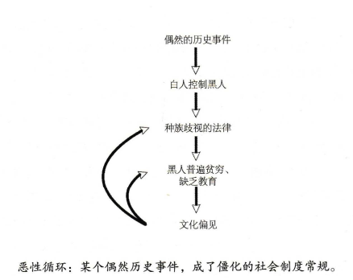

# 《人类简史》

图片来源-[百度图片](https://image.baidu.com/search/detail?ct=503316480&z=0&ipn=d&word=%E4%BA%BA%E7%B1%BB%E7%AE%80%E5%8F%B2&step_word=&hs=0&pn=8&spn=0&di=85564838260&pi=0&rn=1&tn=baiduimagedetail&is=0%2C0&istype=0&ie=utf-8&oe=utf-8&in=&cl=2&lm=-1&st=undefined&cs=3042057660%2C3992402629&os=2451098544%2C3513001380&simid=4115553056%2C691236338&adpicid=0&lpn=0&ln=1914&fr=&fmq=1498663866540_R&fm=&ic=undefined&s=undefined&se=&sme=&tab=0&width=undefined&height=undefined&face=undefined&ist=&jit=&cg=&bdtype=0&oriquery=&objurl=http%3A%2F%2Fwww.xibc.com.cn%2FUserFiles%2Fproducts%2FFrontCover%2Fbig_img%2FCP14100900000546.jpg&fromurl=ippr_z2C%24qAzdH3FAzdH3Fooo_z%26e3Bxtkv_z%26e3Bv54_z%26e3BvgAzdH3Fr6517vp-vg-dclcn0b_z%26e3Bwfrx&gsm=0&rpstart=0&rpnum=0)

## 作者简介

[以色列](http://baike.baidu.com/item/%E4%BB%A5%E8%89%B2%E5%88%97)年轻作家[尤瓦尔·赫拉利](http://baike.baidu.com/item/%E5%B0%A4%E7%93%A6%E5%B0%94%C2%B7%E8%B5%AB%E6%8B%89%E5%88%A9)代表作 ，书在2012年以[希伯来文](http://baike.baidu.com/item/%E5%B8%8C%E4%BC%AF%E6%9D%A5%E6%96%87)出版，然后很快就被翻译成近30种文字，不仅为全球学术界所瞩目，而且引起了一般公众的广泛兴趣。

[尤瓦尔·赫拉利](http://baike.baidu.com/item/%E5%B0%A4%E7%93%A6%E5%B0%94%C2%B7%E8%B5%AB%E6%8B%89%E5%88%A9)，1976年生，[牛津大学](http://baike.baidu.com/item/%E7%89%9B%E6%B4%A5%E5%A4%A7%E5%AD%A6)历史学博士，现为[耶路撒冷希伯来大学](http://baike.baidu.com/item/%E8%80%B6%E8%B7%AF%E6%92%92%E5%86%B7%E5%B8%8C%E4%BC%AF%E6%9D%A5%E5%A4%A7%E5%AD%A6)的历史系教授，青年怪才，全球瞩目的新锐历史学家。

他擅长世界历史和宏观历史进程研究。在学术领域和大众出版领域都有很大的兴趣。

他的《人类简史》一书让他一举成名，成为以色列超级畅销书，这本书已授20多个国家版权，在历史学之外，人类学、生态学、基因学等领域的知识信手拈来，根据图书改编的课程上传YOUTUBE后风靡全球，拥有大批青年粉丝。写书，视频课程之外，他还开设有专栏。

## (1)整体来说，这本书到底在谈些什么？

​	在历史的路上，有三大重要革命：大约7万年前，“认知革命”（Cognitive Revolution）让历史正式启动，认知革命之后，智人就能依据不断变化的需求迅速调整行为，相当于开启了一条采用“文化演化”的快速道路，而不再停留在“基因演化”这条缓慢的道路上。走上这条快速道路之后，智人合作的能力一日千里，很快就远远甩掉了其他所有人类和动物物种。

​	大约12000年前，“农业革命”（Agricultural Revolution）让历史加速发展。农业革命后几千年的历史，可以总结为一个问题：如果人类的基因里没有大规模合作的生物本能，所有的合作网络究竟如何维系？简单的讲法，是人类创造出了由想象建构的秩序、发明了文字，以两者补足我们基因中的不足。

​	而到了大约400年前，“科学革命”（Scientific Revolution）可以说是让历史画下句点而另创新局。

这本书的内容，讲述的就是这三大革命如何改变人类和其他生物。

## (2)作者细部说了什么，怎么说的？

### 认知革命

​	智人（“人属（人类）”的其中一个物种，进化成现代人）之所以能征服世界，是因为有独特的语言。

​	大约7万年前，智人第二次从非洲出击，不只把尼尔安德特人和其他人类物种给赶出了中东，甚至还赶出了世界。没多久，智人的领地就到了欧洲和东亚，45000年前还抵达了澳大利亚。作者认为这些重大的发展，是因为智人的认知能力有了革命性的发展。

​	一种理论认为，人类语言是沟通关于世界的信息的方式。人类语言真正独特的功能时能够传达关于一些根本不存在的事物的信息。据我们所知，只有智能能够表达从来没有看过、碰过、耳闻过的事物，而且讲得煞有其事。虚构故事（神灵、宗教、法令和理想信念等）赋予智人前所未有的能力，让智人得以集结大批人力、灵活合作。只要同样相信某个故事，就能共同合作。智人创造出数百万居民的城市、上亿人口的帝国，秘密在于虚构的故事。人类大规模合作的根基，都在于某种只存在于集体想象中的虚构故事。

​	作者认为，除了存在于人类共同的想象之外，这个宇宙中根本没有神、没有国家、没有钱、没有人权、没有法律，也没有正义。

 	绕过基因组的快速通道：通过文字创造出想象的现实，就能让大批互不相识的人通力合作，只要改变所讲的故事就能改变人类合作方式。在特定情境下，这些故事就能迅速改变，例如1789年，法国几乎是一夕之间，相信的故事就从“天赋君权”转成“人民做主”。

​	认知革命之后，智人就能依据不断变化的需求迅速调整行为，相当于开启了一条采用“文化演化”的快速道路，而不再停留在“基因演化”这条缓慢的道路上。走上这条快速道路之后，智人合作的能力一日千里，很快就远远甩掉了其他所有人类和动物物种。

认知革命的影响

| 名称        | 新能力                                | 更深远的影响                      |
| --------- | ---------------------------------- | --------------------------- |
| 河边有只狮子    | 能够传达大量关于智人身边环境的信息                  | 规划并执行复杂的计划，像是多躲开狮子、猎捕野牛     |
| 八卦（个体间交流） | 能够传达更大量关于社会关系的信息                   | 组织更大、更有凝聚力的团体，规模可达150人      |
| 虚构故事      | 能够传达关于虚构概念的信息，例如部落的守护神、国家、有限公司以及人权 | 1.大量陌生人之间的合作   2. 社会行为的快速创新 |

智人走上了“文化演化”这条快车道，犹如天灭地的人类洪水，导致其他纯粹“基因演化”的物种大量灭绝。

### 农业革命

​	人类曾有长达250万年的时间靠采集及狩猎维生，并不会特别干预动植物的生长情形。农业革命是一场关于人类生活方式的革命。人类操纵着几种动植物的生命，忙着播种、浇水、除草、牧羊。

​	有的人认为农业革命这条路终将导灭亡，是个转折点，让自然抛下了与自然紧紧相连的共生关系，大步走向贪婪，自外于这个世界。

​	**由想象所构建的秩序：**靠着农民多生产出来的食物，加上新的运输技术，越来越多人可以住在一起，先形成村落，在形成城镇，最后成为都市，再由王国或商业网络把他们仅仅相连。这些上百万人生活的秩序如何建立？这是由集体想象所构建的。

​	**真正的坚信者：**我们说《汉莫拉比法典》是虚构的故事，并不会觉得难以接受，但是说到人权也只是虚构的故事，就觉得不可接受。自然界的秩序是稳定的，例如重力不会因为是否有人相信而是否存在，而人类社会的秩序不是那么稳定的。那么必定需要有大部分人坚信并维护这些秩序。即使站在社会金字塔顶端的人，也不一定相信这些秩序，真正的坚信者是大部分的精英分子，例如大多数中国人相信仁义礼智信，儒家思想才可持续两千多年，大多数美国总统和国会议员都相信人权，美国的民主才可持续了250多年。

​	**监狱的高墙：** 不管是基督宗教、民主还是资本主义，都只是由想象所构建出来的秩序。怎样才能让所有人都相信这些秩序呢？第一，对外的说法绝对要坚持他们千真万确、绝非虚构。永远要强调，这种维持的社会稳定的秩序是个客观事实，是由伟大的神或自然的法则所创造的。第二，在教育上也要贯彻同一套原则。从人出生的那一刻起，就要不断提醒这套想象建构出来的秩序。**如何让人类不会觉得组织自己生活的种种秩序不是想象：**

​	**1. 想象建构的秩序深深与真实的世界结合。**

​	虽然这些想象建构的秩序只存在于我们的脑海里，但是它可以与真实的世界仅仅结合、密不可分。像是今天大多数人都相信个人主义，认为每个人都是独立的个体，有独立的价值，而不受他人看法的影响。在现代西方学校里，老师和家长会告诉小孩，受到同学嘲笑并不用太在意，因为只有他们知道自己的真正价值，别人不见得了解。

​	而中世纪的贵族就没有个人主义这一套。他们认为，个人的价值由社会阶级、由他人的看法决定。在这种情形下，“被别人嘲笑”就成了莫大的侮辱。而当时的贵族也会告诉孩子，要不惜一切代价保护名声。

​	**2.想象建构的秩序塑造了我们的欲望。**

​	多数人很难接受自己的生活秩序只是虚构的想象，但事实是我们从出生就置身于这种想象之中，而且连我们的欲望也深受其影响。于是，个人欲望也成为虚构秩序最强大的守护者。例如现代西方人最重视的那些欲望，都是构建在已经为时数百年的虚构故事，包括浪漫主义、民族主义、资本主义以及人文主义。甚至那些人们以为深深藏于自己内心的欲望，通常也是受了想象秩序的影响。例如，许多人很想去国外度假，这件事并没有什么自然或者明显的道理。而想古埃及的法老王，也是把所有财富拿来建造金字塔，把自己的遗体做成木乃伊，而不会有人想要去巴比伦瞎拼或是去腓尼基滑雪。

​	**3. 想象建构秩序的存在于人和人之间思想的连接。**

​	如果要改变这个秩序，那还得说服数百万的陌生人都和我合作才行。原因在于：想象建构的秩序不并非是个人的主观的想象，而是存在于主体间（inter-subjective），存在于千千万万人共同的想象之中。

**“客观”**事物的存在，不受人类意识及新年影响。例如“放射线”，就不是一个虚构的故事。

**“主观”**事物的存在，靠的是某个单一个人的意识和信念。

**“主体间”**事物的存在，靠的是许多人主观意识之间的连接网络。就算有某个人改变了想法，甚至过世，对这项事物的影响并不大。历史上许多重要的驱动因素，都是存在于主体间的概念想法：法律、金钱、神、国家。

​	**身为人类，我们不可能脱离想象所建构出的秩序。每一次我们以为知己打破了监狱的高墙、迈向自由的前方，其实只是到了另一间更大的监狱，把活动范围稍微加以扩大 。**

​	**文字的发明**：一个帝国要运作，会产生大量的信息，除法律之外，还必须记录各种交易、税收、军用物质和商品的库存量，还有各种节庆及打胜仗的日期，而人类大脑的记忆有局限性。采集者从前不需要处理大量的信息，农业革命之后，社会开始变得格外复杂，这驱动了文字的发明。文字是用实体符号来存储信息的方式。语言不断发展得复杂、细化。相物理和工程方面，几乎整个知识领域都快要和人类的口语语言脱节，而由数学符号独挑大梁。数学符号已经带来更革命性的文字系统，计算机使用二进制程序语言，只有0和1两个符号。人工智能的淋浴还希望能够在计算机二进制程序语言上创造一种新的智能。

​	**历史从无正义：**农业革命后几千年的历史，可以总结为一个问题：如果人类的基因里没有大规模合作的生物本能，所有的合作网络究竟如何维系？简单的讲法，是人类创造出了由想象建构的秩序、发明了文字，以两者补足我们基因中的不足。不管是自由人/奴隶、白人/黑人、富人/穷人，都只是虚构的想象所构建出来的。然而铁的历史告诉我们，每一种想象建构出来的秩序，都绝不会承认自己处于想象和虚构，而会大谈自己是自然、必然的结果。阶级区别不过是人类想象的产品罢了，大多数人都会认为只有自己社会阶级是自然的，而其他社会的阶级分法都是虚假又荒谬的。但不幸的是，复杂的人类社会似乎就是需要这些由想象建构出来的阶级制度和歧视。

​	**多数社会政治制度和歧视都没有逻辑或生物学的基础，不过是有历史的偶然事件引起，再用虚构的故事延续壮大。**

### 人类的融合统一

​	**历史的方向：**

​	农业革命之后，人类社会规模变得更大、更复杂。而维系社会秩序的虚构也更为细致完整。人类几乎从出生到死亡都被种种虚构的故事和概念围绕，让他们以特定的方式思考，以额定的标准行事，想要特定的东西，也遵守特定的规范。就是这样，让数百万计的陌生人能遵照着这种人造而非天生的直接，合作无间。这种人造的直觉就是“文化”。

​	没有任何证据，证明历史是为了人类的利益而进展；而原因在于“利益”并没有客观的衡量标准。不同的文化对于“善”的定义不同，而且咩有客观标准可以决定何者为佳。当让，胜利者永远相信自己的定义才正确。但是我们为什么要相信他们呢？

​	每种文化都有代表性的信仰、规范和价值，但也会不断流动改变。只要环境或邻近的文化变化，文化就会有所改变及因应。除此之外，文化内部也会形成一股改变的动力。就算是环境完全与外界隔绝，生态也十分稳定，还是无法避免改变。想观察历史的大方向，要用几千年的跨度，分久必合才是不变的大趋势。

​	公元前的1000年间，出现了三种有可能达到全球一家概念的秩序，第一种是经济上的货币秩序，第二种是政治上的帝国秩序，第三种是宗教上全球性宗教，像是佛教、基督教和伊斯兰教。

**金钱的影响:**

​	金钱正是有史以来最普遍也最有效的互信系统。金钱制度有两大原则，这在大多数情况下是成立的：（1）万物可换；（2）万众相信。这两大原则让数百万的陌生人能够合作各种贸易和产业。虽然金钱能建立起陌生人之间共通的信任，但人们信任的不是人类、社群或某些神圣的价值观，而只是金钱本身及背后那套没人性的系统。金钱就像水，不断渗入社会、宗教和国家所筑成的大坝的裂缝。原本成千上万的独立文化逐渐相连，形成今天的地球村，黄金和白银对于全球化影响深远。

**帝国的影响：**

​	帝国是一种政治秩序，有两项重要特征。第一，帝国必须统治着许多不同的民族，各自拥有不同的文化认同和独立领土。第二，帝国的特征是疆域可以灵活调整，而且可以几乎无限扩张。帝国不改变基本架构和认同，就能够纳入更多其他国家和领土。现代对于帝国的批评通常有两种：（1）帝国制度就是行不通。长远来看，征服许多不同的民族，统治起来一定难有效率。（2）就算能够有效统治，这种做法也不道德，因为帝国正是造成各种毁灭和剥削的邪恶引擎。每个民族都有自决的权利，不该受到其他民族控制。

从历史的角度看，第一点完全没有道理，第二点也满是问题。

​	到了2014年，世界政治基本仍是各行其政，但国家的独立性正在迅速消失。没有任何国家能够真正独立的经济政策，任意发动战争，甚至连国家内政也无法独立决定。对于全球市场，各个国家也只能逐渐开放，组件面对全球性企业和非政府组织的干扰，还得面对全球舆论的监督和国际司法的干涉。各国也得遵守全球在财政、环保和法律上的标准。资金、劳动力和信息构成一股无比强大的潮流，翻转并形塑着现在的世界，国家本身的疆域和意见已经逐渐失利。

​	我们眼下正形成的全球帝国，并不受任何特定的国家或族群管辖。就像古罗马帝国晚期，它是有多民族的精英共同统治，并且是由共同文化和共同的利益结合。在世界各地，越来越多企业家、工程师、专家、学者、律师和经理人得到召唤，一起加入这个帝国，而且越来越多的人已经投入了帝国的一方。

**宗教的影响：**

​	我们今天常认为宗教造成的是歧视、争端、分裂。但是在金钱和帝国之外，宗教正是第三种让人类统一的力量。在历史上，宗教的重要性就在于让这些脆弱的想象秩序的架构有了超人类的合法性。宗教要成为“一种人类规范及价值观的系统，建立在超人类的秩序之上”，有两个基本要素：（1）宗教认为世界有一种超人类的秩序，而且并非出于人类的想象或协议。（2）以这种超人类的秩序为基础，宗教会发展出它认为具有约束力的规范和价值观。例如，虽然现在许多西方人相信鬼魂、精灵、重生，但这些新年并未构成什么道德和行为的标准，所以也就不算是宗教。宗教想要幅员广阔、族群各异的人群收归旗下，就必须具备“普世特质”和”推广特质“。

​	我们的自由政治和司法系统之所以存在，是因为相信每个人都有一个神圣、无法分割、无法改变的内在本质，这点让世界有了意义。这也是一切道德和政治正当性的来源。但这个概念的前身真实传统的基督教信念：相信每个个人体内都有一个自由而不朽的灵魂。然而，过去两百年间，生命科学已经彻底破坏了这个信念。科学家研究人类这个有机体的内部运作，并未找到灵魂的存在。越来越多科学家认为，决定人类行为的不是什么自由意志，而是荷尔蒙、基因和神经突触——我们和黑猩猩、狼和蚂蚁并无不同。我们的司法和政治制度碰上这些发现，多半是视而不见、不愿面对。

​	商业、帝国和全球性的宗教，最后终于将几乎每个智人都纳入了我们今天的全球世界。这个扩张和统一的过程并不是完全直线发展、一帆风顺。但纵观大局，可以看到许多小文化到少数大文化再到最后全球单一文化，应该是人类历史无法避免的结果。

## 科学革命

**发现自己的无知：**

在过去500年间，人类的力量有了前所未有的惊人成长。人类越来越相信可以靠着投资科学研究提升人类的能力，而且这不只是盲目的信仰，而是经过了反复的证明。

​	现代科学与先前的知识体系有三大不同之处：（1）愿意承认自己的无知。（2）以观察和数学为中心。（2）取得新能力，科学与科技紧密结合。现代科学大幅提升了人类理解世界如何运作的能力，以及创造新科技的能力。对于那些数百万人得以有效合作的虚构故事，如果证据显示这些故事都大有问题，社会岂不是要崩溃？要怎样才能让社会、国家和国际体系继续维持运作？只能靠着着这两种不科学的方法：

1.虽然采用科学理论，但必须违反一般科学做法：宣称这就是绝对的真理。纳粹就是采用这种方式，声称他们的种族政策是来自生物事实的推论。

2.不要采取科学方法，而诉诸“非科学的绝对真理”。这一直是自由人文主义的策略。自由人文主义的基础在于坚持主张人类的特殊价值和权利，但很尴尬的是，对智人的科学研究并不认同这种看法。

​	因为科学为人类带来太多的新能力，也就享有崇高的地位。许多人也开始相信，只要取得应用新知，人类就能解决所有的问题。数十亿美元的资金，从政府和企业流进实验室和大学，这一切都不是为了纯粹的科学学术。科学研究之所能得到经费，多半是因为有人认为这些研究有助于达到某些政治、经济或宗教的目的。科学家本身并不一定会觉察到各种控制金钱流动的政治、经济和宗教利益，许多科学家确实只是纯粹为了求知而研究。然而，真正控制科学发展进度表的，也很少是科学家。

​	总之，科学研究一定得和某些宗教或意识形态联手，才有蓬勃发展的可能。意识形态能够让研究所消耗的成本合理化。而代价就是意识形态能够影响科学的进程表，并且决定如何使用研究成果。

**科学与帝国的联姻：**

​	科学也被帝国主义者用于某些邪恶的用途。不论生物学家、人类学家，甚至语言学家都提出了某些科学证据，证明欧洲人优于其他所有民族，因而有权利或责任统治他人。

​	科学家为帝国提供了各种实用知识、思想基础和科技工具，要是没有他们，欧洲人能否征服世界实在仍是未定之数。如果没有帝国的支持，科学能否发展如此蓬勃，也仍是未定之天。但是欧洲各个帝国能蓬勃兴盛，原因不仅仅是科学而已，不论是科学还是帝国，它们能够崛起，背后都还潜藏着一股特别重要的力量：资本主义。

### 资本主义教条

​	在新的资本主义教条里，最神圣的开宗名义的第一条就是：“生产的利润，必须在投资于提高产量。” 所谓的“资本主义”，认为“资本（capital）”与“财富（wealth）”有所不同。资本指的是投入生产的各种金钱、物品和资源。而财富指的是那些埋在地下或是浪费在非生产性获得的金钱、物品和资源。

​	资本和政治这两者的紧密相拥，对信贷市场有深远的影响。一个市场究竟能得到多少信贷，不能只看经济因素（例如发现新的油田、发明新的机器），而也得考虑政治事件的影响，例如政权更迭或是采取了更积极的外交政策。

​	一种观点认为最明智的经济政策就是让政治不要干预经济，将税收和征服管制都减到最低，将一切交给市场力量，让其自由发挥。相信自由市场的概念是天真的，这世界上根本不可能有完全不受政治影响的市场。

**工业革命的巨轮：**

​	在工业革命之前，人类的能源市场几乎完全只能靠植物，植物吸收太阳能，为动物提供能量，人类从动植物中获得能量，不管是牲畜还是人，都使用肌肉获得力量。工业革命的核心，其实就是能源的革命。人类学习如何有效驾驭和转换能量之后，也解决了另一个阻碍经济成长的问题：原谅短缺。工业革命为人类带来了前所未有的种种能源和原料，不仅种类丰富，而且价格低廉。结果就是人类的生产力有了爆炸性的发展。

​	

​	工业革命之后，国家和市场的权利不断扩大，也不断削弱家庭和社群过去对成员的紧密连接。如果组成国家和市场的是一个又一个孤单的个人，而不是关系紧密的家庭或社群，要干预个人生活也就容易得多。现代高楼公寓，所有人各自锁在自己家里，连每户该付多少清洁费都无法达成共识，有怎么可能一起站出来抵抗国家机器？

**什么是快乐？**

​	目前大多数的意识形态和政治纲领，虽然都所追求人类幸福，但对于幸福快乐的真正来源为何却还是不明就里。民族主义会说正字自决能够带来快乐。共产主义者会说无偿阶级专政能够带来快乐。资本主义者会说自由市场能够创造经济成长，能够教导人类自立自强、积极进取，所以能够为最多人带来快乐。

​	从历史来看，人类的能力不断增强，但期望/欲望也越高，今天的人不一定比远古的人快乐。

​	一种观点认为快乐在于感受快感，要想更快乐，就得操纵我们的生化系统。生物学家认为，我们的心里和情感世界其实是由经过数百万年演化的生化机制所形塑。所有的心里状态（包括主观幸福感）并不是由外因素（如工资、社会关系或政治权利）来决定，而是由神经、神经元、突触和各种生化物质（例如血清素、多巴胺和催产素）构成的复杂系统而定。我们能够快乐的唯一原因，就是身体内发出快感的感官感受。但是大多数生物学家也不是完全只看生物这一套，也同意心理学和社会学因素同样有其影响力。

​	另一种观点认为快乐是觉得生命有意义，想要更快乐，就得要骗自己骗的更彻底。快乐不只是“愉快的时刻多于痛苦的时刻”这么简单，快乐是要看某人生命的整体；生命整体有意义、有价值，就能得到快乐。生活有意义，就算在困境中也能甘之如饴；生活无意义，就算在顺境中也度日如年。

​	以上两种观点都有一个共同假设：快乐是一种主观感受（不管是感官的快感还是生命有意义），而想要判断快不快乐，靠的就是直接问他们的感受。这是自由主义者的主要观点。

​	大多数宗教和哲学看待快乐的方式，都与自由主义非常不同。佛教认为，快乐既不是主观感受到愉悦，也不是主观觉得生命有意义，反而是在于放下追求主观感受这件事。按照佛教的观点，事实上，人类的主观感受没有任何实质或意义。主观感受只是一种电光石火的波动，每个瞬间都在改变，就像海浪。不论你感受到的是快感或不快，觉得生命是否有着意义，这都只是一瞬间的波动而已。如果我们太看重内部的波动，就会变得太过执迷，心灵也就焦躁不安、感到不满。每次碰上不快，就觉得受苦。而且就算已经得到快感，因为我们还希望快感能够增强或是害怕快感将会减弱，所以心里还是不能感到满足。追求这些主观感受十分耗费心神，而且终是徒劳，只是让我们受制于追求本身。苦的根源就在于“追求”主观感受这件事，不管追求的是什么，都会让人陷入持续的紧张、困惑和不满之中。佛教给我们的建议是，除了别在追求外在之外，同时也别追求呢些感觉良好的心里感受了。

**智人末日：**

​	就在21世纪之初，智人开始打破生物因素的限制，自然选择的法则开始被打败，转而由智慧设计（intelligent design）法则取而代之。有三种方式可能让智慧设计取代自然选择：生物工程、仿生工程与无机生命工程。

​	在7万年前，智人还只不过是一种微不足道的动物，在非洲的角落自顾自地生活。时至今日，智人似乎只要再跨一步就能进入神的境界，不仅有望获得永恒的青春，更拥有创造和毁灭一切的神力。一次又一次，虽然整体人类的能力大幅提升，但却不一定能改善个别人类的福祉，而且常常还让其他动物深受其害。虽然现在人类拥有血多令人赞叹的能力，但是我们仍然对目标感到迷茫，几乎不知道怎样使用这些力量。而且似乎仍然总是感到不满，对周遭的动物和生态凶掀起一场灾难，只为了寻求自己的舒适和娱乐。

## (3)这本书说的有道理吗？是全部有道理，还是部分有道理？

​	这本书不仅是关于历史，也是关于哲学和人生的探讨。它从一个非常宏观的角度来看人类历史的发展。特别是讲述认知革命和农业革命，论述得很精彩，让人信服。智人如何从普通的动物的演化中脱颖而出，从“基因演化”的慢车道到"文化演化"的快车道，如何建构大规模合作的秩序，关于这些内容的论述很深刻，逻辑性很强，而且是从生物学、政治学和心里学等学科的角度做出全方位的考察。

## (4)这本书跟你有什么关系？

​	看完这本书，使我对现在宗教、国家、文化和法律等意识形态的理解和思考方式都有新的启发，有种顿悟的感觉，原来是这么回事。书中对什么是快乐的探讨更是让我耳目一新，原来快乐可以有这么多种理解。而我自己一直认为的快乐只不过现代自由主义的一种主流观点而已，这样的一种观念在自己心中根深蒂固，未曾去深入了解过其他对什么是快乐的一些理解。例如佛教对快乐的理解，也是令我赞叹不已。这才发觉宗教在我的潜意识里是一种迷信，未曾想到过有如此深刻的哲学思考。