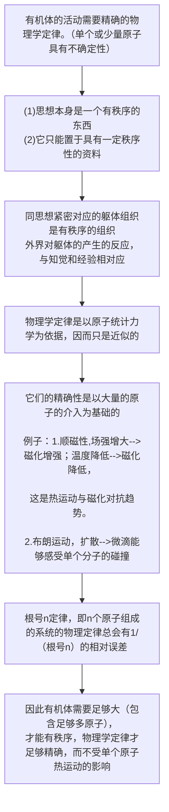

# 《生命是什么》

[奥]埃尔温.薛定谔 著，罗来鸥，罗辽复 译

## 简介

[诺贝尔奖](https://baike.baidu.com/item/%E8%AF%BA%E8%B4%9D%E5%B0%94%E5%A5%96)获得者[埃尔温·薛定谔](https://baike.baidu.com/item/%E5%9F%83%E5%B0%94%E6%B8%A9%C2%B7%E8%96%9B%E5%AE%9A%E8%B0%94/2124805)的《生命是什么》是20世纪的伟大科学经典之一它是为门外汉写的通俗作品，然而事实证明它已成为分子进化诞生和随后DNA发现的激励者和推动者，本书把《生命是什么？》和《意识和物质》合为一卷出版，后者也是他写的散文，文中研究了那些自古以来就使哲学家困惑迷离的问题，和这两篇经典著作放在一块的是薛定谔的自传。通过对他一生的回顾和引人入胜的描述，提供了他从事科学著作的背景材料。

## 从经典物理学角度对生命的思考

一个朴素物理学家（薛定谔）关于有机体的观点：

提出问题：为什么原子是如此之小，身体为什么一定要这么大？提着问题的目的是思考有机体的尺寸。

下面按照薛定谔的思路一步步深入推论：

## 遗传机制

上述从经典物理学角度那些绝非无关要紧的设想是错误的。

1.实际上，在活有机体内有许多极其小的原子团，小到不足以显示精确的统计物理学定律，而它们在极有秩序和极有规律的事件中起着支配作用。

2.遗传的密码本（染色体）

3.通过细胞分裂（有丝分裂）的个体生长。在有丝分裂中每个染色体是被复制的。

4.染色体减半的细胞分裂（减速分裂），精子和卵子。

精子和卵子是单倍体，受精卵是二倍体。

5.单倍体个体

雄蜂--蜂后的单倍体的卵产生，无父亲！

单倍体还有苔藓植物。

6.交换，特性的定位（等位基因交换）

7.基因的最大尺度

估计基因的尺度300埃，原子数不超过几百万个或一百万，从根号n的角度看，这样的数目还是太小了。一百万的精确性只有千分之一。而这是很保守的估计，实际是很少量的，可能比1000个还要少。

8.持久性

基因可以保持几个世纪不变的，甚至更久，例如哈布斯堡王朝的一种哈布斯堡唇现象。遗传特征被复制若干世代，而没有可觉察的变化。这是一个奇迹，人的整个生命完全依赖于遗传的奇妙的相互作用。然而这可能超越人类的理解能力之外。

## 突变

1.自然突变，这学过一点生物学的人应该都知道达尔文的进化学说，不必多说。

2.人工诱导突变

第一定律：突变是个单一性事件

（1）突变频数的增加量严格地同射线的剂量成正比例，因而人们确实可以引进突变系数来表达这种比例关系。

第二定律：事件的局域性

（2）如果广泛地改变射线的性质（波长），从软的x射线到相当硬的$\gamma$射线，只有给予同一剂量，突变系数保持不变。

## 量子力学的证据

1.量子力学无法解释的持久性

把生物学稳定性归结到花型稳定性是没有价值和靠不住的。两种现象表面上相似的特性依据同一原理，当这个原理本身是未知的。

2.可以用量子论来解释

对于生物稳定性量子理论提供了解释。遗传机制是同量子论的基础密切相关的，应该说是建立在量子论的基础之上。

量子理论是马斯克.普朗克于1900年发现，现代遗传学几乎也是同时代产生的。

“量子跃迁”与突变之间有直接的联系。

量子论--不连续状态--量子跃迁

3.分子的稳定性有赖于温度。

4.非周期性晶体

一个基因--也许整个染色体纤丝--是一种非周期性的固体。

5.熵

在温度处于绝对零度时（约-273摄氏度），任何物质的熵都等于零。

生命物质避免了向平衡衰退，即避免向热力学平衡或“最大熵”状态转化。因此可以说，一个有机体以“负熵”为生。可以说生命从环境中抽取“序”来维持组织。

生命以负熵为生，就像是活着的有机体吸引一串负熵去抵消它生活中产生的熵的增量，从而使它自身维持在一个稳定而又低熵的水平。

## 生命是以物理学定律为基础的吗

1.有机体中可能有的新定律

