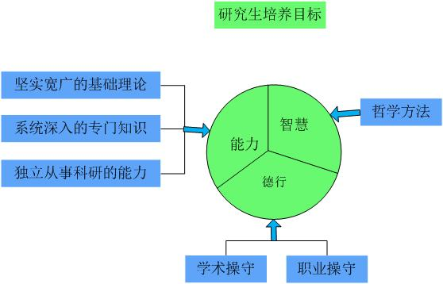

# 我的研究生生涯

## 个人收获

我的经历使我觉得读研的三年重要的是这个科研训练的过程，三年所学的科学知识甚少，因为常常是针对一个很具体的问题进行研究。但是这个训练过程会使得自己思考问题、解决问题的思路和方法更加全面和科学性。比如多了一点批判的思维，对一些事物不会那么盲目去相信，多一点理性思考。

研究生三年，我没有做出轰动业界的发现，或者发明炫酷的机器，所获得的科学知识甚少，但是“授之以鱼不如授之以渔”，没有经过这三年的科研训练，或许某一天，在浩瀚无边的知识的面前，无穷真理的面前，我会望而却步。研究生的科研生活，或许有枯燥，或许有彷徨，或许有畏惧，但是也有收获的点滴喜悦，用心地感受和领悟，我竟然不会再因为时光匆匆，生命有限而忧虑，不会再因为知识的浩瀚，真理的无穷而畏惧，而只有迫不及待去探索的欲望。我渐渐地发现自己是一个以科学、技术和创新为生命意义的人，怕什么真理无穷，进一寸有一寸的欢喜！追随好奇之心，发挥创造之力，为国家的强大尽微薄之力，为人类科学技术的发展而努力。

总的来说，有三方面的收获，首先是拓宽了自己的视野，不再只关注身边的事物，懂得去了解世界上某些领域的发展。其次是确立了终身学习和持续学习的观念，面对浩瀚的知识，无穷的真理，我们的个人的认知显得十分渺小，但是怕什么真理无穷，进一寸有一寸的欢喜！我会以这样的心态保持持续学习、研究的习惯。最后，对于自己追求的是什么以及如何度过这短暂的生命，有了新的认识。因此，研究生三年的学习研究过程，是生命中特别珍贵的一段时光。

## 树立自己的理想追求

本科的时候大三大四沉迷与游戏，荒废了很多时间，读研究生还是那么迷茫、时而焦虑、时而斗志满满，但还是被一些问题困扰着，例如，人活着的意义是什么？我要追求怎样的人生，轰轰烈烈干一番事业，还是平平淡淡度过一生？这又有什么区别吗？对于历史长河，个体的生命如此短暂，人终有一死，我有点无法接受将来某一天就会从世界上消失，永远的离开这个世界。对于这些问题，没有想通，没有坚定的信念。大学又极其地自由，对于没有坚定理想，没有坚定信念的人，是及其容易荒废时光，堕落的。研一的时候，所做的课题与兴趣相差很大，我仍然处于一种沉迷于游戏、没有自制力、拖沓，没有追求的状态，感觉读了个大学反而培养了一堆坏习惯。荒废时间又使自己很懊悔，又开始各种怀疑人生，然后又继续颓废，如此恶性循环。感觉总有两种对立思想在斗争，一种是积极上进，一往无前，追求卓越，想成就大事业的思想；一种是则是甘于平庸，享乐主义，得过且过的思想。这两种思想不相上下，因此，大学后面两年到研究生，都是荒废堕落与追求上进相交织的一种状态。

记得研一下上学期，微机感增强，感受到了毕业压力、就业压力和生命有限等，迫使自己必须采取一些措施，来改善当前的状态，因此，还咨询了学校的心理医生，寻找解决办法。最后给制定了以下的目标及理想追求，当然这也是自己发自内心的追求。

**总体长远目标**

长远目标，即成为一个怎么样的人。我的目标是成为一个杰出的工程师，在人工智能和机器人领域有所成就，成为一个有思想有智慧的人。我崇拜的偶像是尼古拉.特斯拉和爱因斯坦，他们在科学和技术领域都有杰出成就，并且多才多艺。尼古拉.特斯拉既是科学家，也是哲学家、诗人、语言学家，精通八种语言。他一生被评出9次诺贝尔奖，但他全部让给别人。

**近期目标（研究生阶段）**

**学习目标**

主要目标抓紧时间拓展知识面；培养一项特长--程序设计；完成毕业设计课题顺利毕业；

专业知识方面：培养一项特长，深入研究c++程序设计和数学优化算法等人工智能领域的知识理论和实现方法。另外完成研究生毕业的要求，完成1篇学术论文和毕业论文，老师安排的任务尽量高效率完成。存在问题是毕业设计的课题和以后期望从事的领域可能会不一样，要协调好时间。不必追求太多无实际意义的论文发表、奖学金等荣誉，要以长远目标为中心安排自己的计划。

人文哲学方面：每周阅读300页左右，即每天阅读45页，估计每周阅读一本书，一年总计48本。首先读完手上的《直视骄阳》、《灵魂机器的时代》和《最后的舞蹈》存在问题是阅读速度比较慢，因此要刻意地提高阅读速度。

**身体素质目标**

作息时间：晚上12:00前睡觉，早上6:30起床。

锻炼计划：每天傍晚饭后散步30分钟，每周骑行1次。

**人际关系目标**

（1）乐于助人，真诚帮助需要帮助的人。（目前在学习方面做的较好）

（2）同学朋友的活动和聚会尽量参加。每周qq或电话联系一下1~2个久不见面的同学朋友。

（3）换位思考，多从他人感受的角度考虑问题。

**行为习惯目标**

尽量按时吃饭；当天的衣服当天洗；说话要大声清楚，敢做敢为，不可畏手畏脚；要做的事尽快完成，不拖沓。

**总体学习工作时间表**

除了上课和特殊情况，每天执行学习工作时间表的内容。

| 时间          | 周一至周五     | 周六                | 周日        |
| ----------- | --------- | ----------------- | --------- |
| 6:30—7:00   | 起床洗漱      |                   |           |
| 7:00—7:50   | 朗读英语或中文   | 朗读英语或中文           | 朗读英语或中文   |
| 8:00—12:00  | 实验室，研究课题  | 实验室，总结本周课题研究，完成周报 | 在南宁附近骑行   |
| 12:00—12:30 | 午饭        | 午饭                | 午饭        |
| 12:30—14:00 | 练一面钢笔字，午休 | 练一面钢笔字，午休         | 练一面钢笔字，午休 |
| 14:00—17:30 | 实验室，研究课题  | 图书馆随意阅读           | 图书馆阅读人文书籍 |
| 17:30—18:00 | 晚饭        | 晚饭                | 晚饭        |
| 18:30—19:00 | 散步        | 散步                | 散步        |
| 19:00—20:00 | 人工智能的理论学习 | 人工智能的理论学习         | 图书馆阅读人文书籍 |
| 20:00—22:30 | 实验室，研究课题  | 实验室，研究课题          | 图书馆阅读人文书籍 |
| 22:30—23:00 | 洗澡洗衣服     | 洗澡洗衣服             | 洗澡洗衣服     |
| 23:00—0:00  | 阅读书籍      | 阅读书籍              | 安排下周的具体计划 |
| 0:00:—6:30  | 睡觉        | 睡觉                | 睡觉        |

例如，下面是其中某一周的任务：

2015.6.25~2015.6.28

| 任务      | 具体内容                                     |
| ------- | ---------------------------------------- |
| 研究课题    | 阅读甘蔗压榨提汁理论及研究压榨机的具体结构及特点，尝试提出蔗渣压榨过程中液固耦合、排汁的研究问题，初步提出研究内容和方法。 |
| 人工智能的理论 | 阅读《灵魂机器的时代》，了解计算机的发展历程以及人工智能的思想方法。       |
| 编写程序或软件 | 研读截图工具的c++代码，并重新编写                       |
| 读人文书籍   | 《直视骄阳》                                   |
| 在南宁附近骑行 | 拜访A哥，参观他的摄影室                             |

**2016年计划**

1.做好毕业课题； 2.锻炼身体；3.学车拿驾照；4.坚持规律作息；5.关注招聘信。

| **2016**        |            |            |           |
| --------------- | ---------- | ---------- | --------- |
| **时间**          | **周一至周五**  | **周六**     | **周日**    |
| **6:30-7:00**   | **起床洗漱**   |            |           |
| **7:00-7:50**   | **早读**     | **早读**     | **早读**    |
| **8:00-12:30**  | **实验室，课题** | **实验室，课题** | **图书馆阅读** |
| **12:30-13:00** | **午饭**     | **午饭**     | **午饭**    |
| **12:50-14:00** | **刷牙午休**   | **刷牙午休**   | **刷牙午休**  |
| **14:00-17:30** | **实验室，课题** | **总结，周报**  | **图书馆阅读** |
| **17:30-18:00** | **跑步**     | **跑步**     | **跑步**    |
| **18:00-19:00** | **吃饭洗澡**   | **吃饭洗澡**   | **吃饭洗澡**  |
| **19:00-22:40** | **实验室，课题** | **实验室，课题** | **图书馆阅读** |
| **23:00-1:00**  | **编程等**    | **编程等**    | **编程等**   |
| **1:00- 6:30**  | **睡觉**     | **睡觉**     | **睡觉**    |

要十分严格地按照时间表执行还是比较有难度的，有时候还是忍不住会去玩游戏，没半个月总有那么一两天会玩一整天游戏。但是制定了目标和任务，效果还是十分明显的，坚持了近一年时间，所收获的感觉比以前两年还多。直到找到了相对合适的工作后，没有了就业压力，毕业压力还是有，因此时间表上很多与课题无关的内容基本没有去做，把时间安排到毕业课题的研究了。

## 课题方向与就业方向的矛盾

我的专业是机械电子工程，报的研究方向是机电控制及自动化，这当然是我的兴趣所在。但是我做的毕业课题是破碎的甘蔗的本构模型及甘蔗压榨提汁的数值模拟，主要涉及于材料力学、有限元仿真、渗流力学和制糖工程领域，这与我的兴趣及以后个人想从事的就业方向有较大差异，因此存在着课题方向与今后就业方向的矛盾。当然，有时候研究生要做什么样的课题，往往是个人控制不了的，相信很多过来人会有这样的感受。面对课题方向与就业方向的矛盾，应该怎么办？是否放弃兴趣爱好，好课题研究，做好当下的事就行了呢？但是我觉得个人主观能动性还是很重要的，我不能因为研究生三年做了自己不感兴趣的东西，就限制了今后几十年的工作方向，放弃自己的兴趣所在。因此我为自己指定了以上的研究生阶段的目标和任务，其中涉及到编程与人工智能，与毕业课题无关的一些内容。

在学习个人兴趣的内容时中也觉得只学习书本上的理论很难适应以后就业的能力需求，企业也很看重实践能力，因此要结合实践来学习才合适。我要学一点编程和控制相关的，要做点实践，并且成本不能太大。首先在慕课网学习了Linux的基础教程，然后找到了一个比较火的无人机开源项目pixhaw/px4，在ubuntu下搭建了开发环境。在淘宝网购买了无人机的配件，自己组装了个四轴飞行器，编译px4飞控软件到无人机上。这样平时学习无人机的一些理论及看飞控代码，周末有时间就去调试，放飞飞机。记得第一次看着自己装的四轴飞起来的时候十分兴奋。先晒几张图再说。

组装中的四轴飞行器

自己加了一个面目狰狞蟑螂外壳

随着对无人机开源项目的学习，在网上搜索资料时，又了解到很多其他的开源项目，以及CSDN相关博客，发现有一些博客写的很好，后来自己也有了写博客的想法，把自己一些学习经验和收获记录下来。发现写博客其实是对所学知识的总结，同时更容易看到自己的一些学习成果，更添加了成就感，对学习新知识有了更大的兴趣，也从中获得乐趣。

## 结束语

回想一些研究生生涯，曾经的主要目标完成了多少？首先是培养一项编程（当然是指涉及机电控制方面）特长，做了一些学习与实践（学习无人机开源项目）。但是学习深度还是不够，只能说完成了目标的一小部分。其次是做好毕业课题顺利毕业，课题难度挺大的，国内还没有人做过这方面的研究。但是我还是克服了很多困难，达到了毕业的要求。这个我觉得是完成得不错的，发了一篇机械工程学报的论文，毕业论文也顺利通过答辩了。最后是书籍的阅读，这个目标远远没有完成，三年研究生也没读多少本书。这个目标是长远的，伴随今后整个人生，因此现在有重新加强了读书的精力投入，制定每年、每月的读书计划（参见前面的一篇博客[2017读书计划](http://blog.csdn.net/libing403/article/details/72777531)）。

目前签的工作从事是运动控制器与机器人开发，这正合适自己的兴趣。由于研究生三年对这方面的研究还是很少，因此从现在开始就要抓紧时间学习相关知识与技能，才能做好今后的工作。