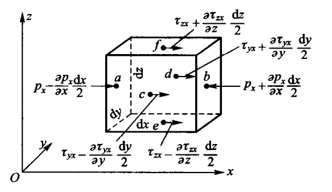

[TOC]

##1. 引言

$\qquad$纳维-斯托克斯方程（Navier-Stokes equation）描述粘性不可压缩流体动量守恒的运动方程，简称N-S方程。此方程是法国科学家C.-L.-M.-H.纳维于1821年和英国物里学家G.G.斯托克斯于1845年分别建立的。后人在此基础上又导出适用于可压缩流体的N-S方程。以应力表示的运动方程，需补充方程才能求解。N-S方程反映了粘性流体（又称真实流体）流动的基本力学规律，在流体力学中有十分重要的意义。它是一个非线性偏微分方程，求解非常困难和复杂，在求解思路或技术没有进一步发展和突破前只有在某些十分简单的流动问题上能求得精确解；但在有些情况下，可以简化方程而得到近似解。例如当雷诺数Re<1时，绕流物体边界层外 ，粘性力远小于惯性力 ，方程中粘性项可以忽略，N-S方程简化为理想流动中的欧拉方程；而在边界层内，N-S方程又可简化为边界层方程，等等。在计算机问世和迅速发展以后，N-S方程的数值求解才有了很大的发展。
##2. 纳维-斯托克斯方程[^1]
$\qquad$选取流场中任意一点的三个平面，法向分别沿$x、y、z$向。各个平面上一般存在压应力和切应力。设用$\tau_{ij}$的$i$向表示平面上的$j$向应力分量：
$x$向平面：压应力$p_x$,切应力$\tau_{xy}$和$\tau_{xz}$;
$y$向平面：压应力$p_y$,切应力$\tau_{xy}$和$\tau_{xz}$;
$z$向平面：压应力$p_z$,切应力$\tau_{xy}$和$\tau_{xz}$;
固体力学中应力-应变关系称为固体的本构关系，流体的本构关系是应力和角变形速率之间的关系。这里用角变形速率是因为流体发生角变形时才能抵抗切应力。三维角变形率为$\mathcal{E}_{xy}=\mathcal{E}_{yx},\mathcal{E}_{yz}=\mathcal{E}_{zy},\mathcal{E}_{zx}=\mathcal{E}_{xz}$。牛顿内摩擦定律实质上是切应力与角变形速率之间成比例的关系，三维流场的该比例关系可以写成
$$
\begin{equation}
\tau_{xy}=\mu(2\mathcal{E}_{xy}), \tau_{yz}=\mu(2\mathcal{E}_{yz}), \tau_{xz}=\mu(2\mathcal{E}_{xz})  \tag{1}\label{1}
\end{equation}
$$
式$\eqref{1}$称为广义牛顿摩擦定律。对于常密度流体，利用该定律可推出$p^{'}_n=-2{\mu}{\mathcal{E}_{nn}}$，由此得到压应力的分解式$p_n=p-2{\mu}{\mathcal{E}_{nn}}$。写成分量的形式，有
$$
\begin{equation}
  p_x=p-2{\mu}\frac{\partial u}{\partial x} , 
    p_y=p-2{\mu}\frac{\partial v}{\partial y} ,
    p_z=p-2{\mu}\frac{\partial w}{\partial z} \tag{2}\label{2}
    \end{equation}
$$

图1 六面体流体微元的受力

$\qquad$可见，常密度流体的附加压力来源于线变形速率$\mathcal{E}_{nn}$。当流体为微团伸长变形（$\mathcal{E}_{nn}>0$）时，周围流体对它产生拉力，故$\mathcal{E}_{nn}$前面要加负号。由式$\eqref{2}$出发，可检验某流场的动压强是否各向等值（即$p=p_x=p_y=p_z$）。

$\qquad$六面体微元在$x$向收到的作用力如图1所示。设微元中心的$x$向应力为$\tau_{zx}、\tau_{zy}、p_x$。上、下表面的切应力为$\tau_{zx}{\pm}({\partial \tau_{zx}}/{\partial{z}})(dz/2)$，两者的合力为$(\partial \tau_{zx}/\partial {z})dxdydz$；前、后侧面上切应力为$\tau_{yz}\pm (\partial{\tau_{yz}/\partial{y}})(dy/2)$，合力为$（\partial{\tau_{yx}/\partial{y}}）(dy/2)$；左、右表面的压应力为$p_x\mp(\partial{p_x}/\partial{x})(dx/2)$，合力为$(-\partial{p_x}/\partial{x})dxdydz$。根据式$\eqref{1}$、式$\eqref{2}$和$\mathbf{\nabla\bullet u=0}$，可以推得x向所受的粘性力
$$
\frac {\partial}{\partial x}{(\nu \frac{ \partial{u}}{\partial x})}  \
+\frac {\partial}{\partial y}{(\nu \frac{ \partial{u}}{\partial y})}  \
+\frac {\partial}{\partial z}{(\nu \frac{ \partial{u}}{\partial z})}  \
$$
同理可以推得六面体$x、y$向粘性力。由此可得粘性流体的微分方程
$$
\begin{equation}
\frac {\partial u }{\partial t}+u \frac{\partial u}{\partial x}+v \frac {\partial u}{\partial y}+w \frac{\partial u}{\partial z} 
=f_x-\frac{1}{\rho} \frac{\partial p}{\partial x}
+\nu (\frac{\partial ^2 u}{\partial x^2}+\frac{\partial ^2 u}{\partial y^2}+\frac{\partial^2u}{\partial z^2})     \\

\frac{\partial v}{\partial t}+u \frac{\partial v}{\partial x}+v \frac{\partial v}{\partial y}+w \frac{\partial v}{\partial z}
=f_y-\frac{1}{\rho} \frac{\partial p}{\partial y}
+\nu (\frac{\partial ^2v}{\partial x^2}+\frac{\partial ^2v}{\partial y^2}+ \frac{\partial ^2v}{\partial z^2})  \\

\frac{\partial w}{\partial t}+u \frac{\partial w}{\partial x}+v\frac{\partial w}{\partial y}+w \frac{\partial w }{\partial z}
=f_z-\frac{1}{\rho} \frac{\partial p}{\partial z}
+\nu (\frac{\partial ^2w}{\partial x^2}+\frac{\partial ^2w}{\partial y^2}+\frac{\partial ^2w}{\partial z^2})  
\end{equation}
\tag{3}\label{3}
$$
这就是著名的纳维-斯托克斯方程，简称N-S方程，是由法国土木师纳维和英国物理学家斯托克斯创立的。N-S方程的矢量形式为
$$
\begin{equation}
\frac{\partial \mathbf u}{\partial t}+(\mathbf {u \bullet \nabla})\mathbf u 
=\mathbf f-\frac{1}{\rho}{\mathbf \nabla}p+\nu \mathbf{\nabla^2}\mathbf{u}
\end{equation}
\tag{4}\label{4}
$$
其中
$$
\mathbf{\nabla ^2u}=\mathbf{i\nabla^2}u+\mathbf {j \nabla ^2}v+\mathbf{k \nabla^2}w   \tag{5}\label{5}
$$
式中，$\mathbf{\nabla^2}$是拉普拉斯算子符。

$\qquad​$N-S方程与连续性方程$\mathbf{\nabla \cdot u}=0​$一起，构成N-S方程组，它是描述不可压缩流体运动的通用方程，假设能获得解析解，它包含三维流场的流速和压强空间分布和时间变化的所有细节。N-S方程组在现代流体力学领域应用非常广泛，然而他是非线性方程组，其中迁移加速度$\mathbf{(u\cdot \nabla)u}​$是非线性的，目前数学上尚未找到获取解析解的通用方法，只有个别流场才能推出。

[^1]: 李玉柱, 苑明顺. 流体力学[M]. 北京: 高等教育出版社, 2008