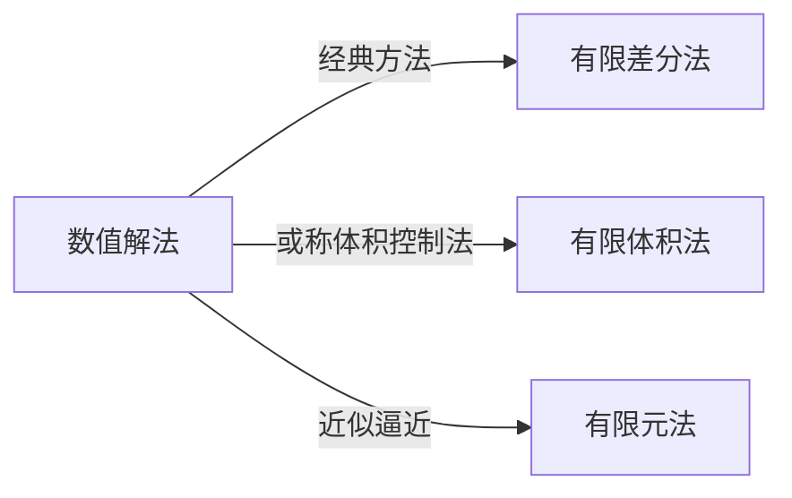

# 偏微分方程的数值解法

 	在计算流体力学中，研究流体运动规律的手段是采用数值计算方法，求解描述流体运动基本规律的数学方程，以数值模拟的结果为依据研究流体运动的物理特征。目前应用比较广泛的计算方法：有限差分方法、有限体积法和有限元法。此外，还包括 ADINA 开发的 FCBI 和 FCBI-C 单元算法。

```mermaid
graph LR
A[数值解法]-->|经典方法|B[有限差分法]
A[数值解法]-->|或称体积控制法|C[有限体积法]
A[数值解法]-->|近似逼近|D[有限元法]
```

