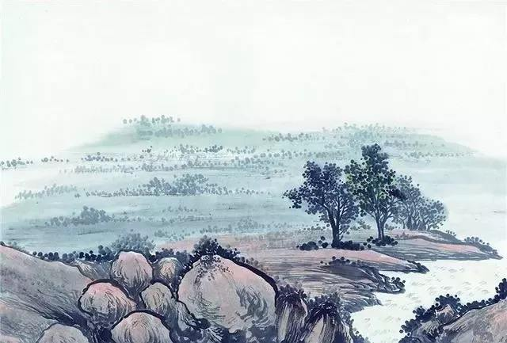

# 感遇（其七）--张九龄

##感遇（其七）

**张九龄**

**江南有丹橘，经冬犹绿林。**

**岂伊地气暖，自有岁寒心。**

**可以荐嘉客，奈何阻重深。**

**命运惟所遇，循环不可寻。**

**徒言树桃李，此木岂无阴？**

【赏析】

江南生长着丹橘，它经历严冬却能葱翠依然，这并非是因为那里的气候温暖，而是橘树本身具有耐寒的禀性。

丹橘佳美，可以用来招待嘉客，无奈有重重阻隔，山高水深。在这个命运只在机遇、事理难以穷究的纷乱尘世里，世人只知道倾心于桃李的浮华艳媚，难道丹橘不是更有葱郁不凋的树荫吗？

世人以丹橘自比，委婉含蓄地表达了对自己因为正直而遭贬逐的悲愤之情，期待朝廷重新启用的心意也是灼然可见，末尾“徒言树桃李，此木岂无阴”的反诘，深沉凝重，矛头直指唐玄宗后期任用奸人，排斥贤良的用人政策。