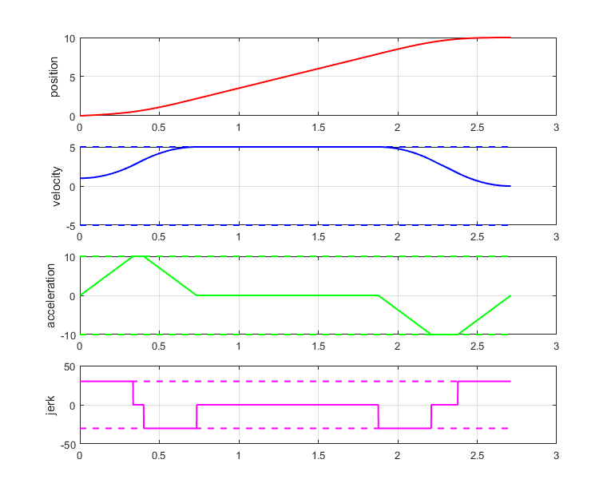

# S型速度规划

## 摘要

梯形速度曲线出现加速度不连续的情形，这样会导致机械系统出现冲击或不可预料的振动效应。因此有必要定义一种更加平滑的运动曲线，例如采用连续的，线性的加速度曲线，如下图所示，速度曲线抛物线过渡的线段组成。由于速度曲线的形状，这个轨迹称为双S速度曲线。这个轨迹有七段加加速度恒定的轨迹组成，因此又叫七段式轨迹。


## 分析讨论

假设
$$
j_{min}=-j_{max},\text a_{min}=-\text a_{max},v_{min}=-\text v_{max}
$$
为了方便分析，首先假设$t_0=0,q_1>q_0$。那么边界条件为

- 初始速度和终止速度为$v_0,v_1$.
- 初始和终止加速度$\text a_0,\text a_1$均为0.

曲线可以分为三段

1. 加速段，$t \in [0,T_a]$,加速度从0线性增加到最大，再减小到0.
2. 最大速度段，$t\in [T_a,T_a+T_v]$,具有恒定的速度。
3. 减速段，$t\in [T_a+T_v,T]$,这里$T=T_a+T_v+T_d$,减速度曲线与加速段相反。

给定最大的加加速度$j_{max}$,加速度和期望位移$h=q_1-q_0$.轨迹的计算按照式（3.30a）-(3.30g)。

第一步是检验轨迹是否真的存在。实际上轨迹根据给定参数需要分几种情况计算。比如，给定位移h太小时，速度无法从$v_0$变化到$v_1$。这样的限制下可能只有加速段（$v_0<v_1$）或减速段($v_0>v_1$)。

因此首先需要检验是否同时存在加速段和减速段。定义
$$
T_j^*=\text {min} \left (\sqrt {\frac {|v_1-v_0|}{j_{max}}},\frac{ \text a_{max} }{j_{max}} \right  )
\tag{3.17}
$$
若$T_j^*=\text a_{max}/j_{max}$,加速度可以达到最大值，有可能存在加加速度为0的线段。

如果满足以下条件，则轨迹可行
$$
q_1-q_0>\begin{cases}
T_j^*(v_0+v_1), \text{if} \ T_j^*<\frac{\text a_{max}}{j_{max}}\\
\frac{1}{2}(v_0+v_1)\left (   T_j^*+\frac{v_1-v_0}{\text j_{max}}    \right),\text{if}\ T_j^*=\frac{\text a_{max}}{j_{max}}
\tag{3.18}
\end{cases}
$$
若上式满足，则可以计算轨迹的参数，否则给定的参数都无法在指定的位移从初始速度变化到末速度（这时候可以改变初始速度或末速度的值，可另外讨论。这不在本文的讨论范围内）。假设运动中的最大速度为$v_{lim}=\text {max}(\dot q(t))$,这时存在两种情况

Case1 :$v_{lim}=v_{max}$.

Case2:$v_{lim}<v_{max}$.

第二种情形，最大速度不能达到，只有加速段和减速段，没有匀速段，只有计算轨迹参数后才能判断。

当给定位移较小时，在Case1和Case2中有可能都达不到最大加速度。

我们定义

$T_{j1}$ ：在加速度段加加速度恒定（$j_{max}或j_{min}$）的时间；

$T_{j2}$：在减速段加加速度恒定（$j_{max}或j_{min}$）的时间；

$T_a$：加速度段时间；

$T_v$：匀速段时间；

$T_d$：减速段时间；

$T$：总时间（$=T_a+T_v+T_d$）

### Case1:$v_{lim}=v_{max}$

通过下面的条件判断是否达到最大加速度

if
$$
(v_{max}-v_0)j_{max}<\text a^2_{max}
\tag{3.19}
$$
$\text a_{max}$达不到

if
$$
(v_{max}-v_1)j_{max}<\text a^2_{max}
\tag{3.20}
$$
若(3.19)满足，则加速段的时间用下式计算
$$
T_{j1}=\sqrt{\frac{v_{max}-v_0}{j_{max}}},T_a=2T_{j1}\tag{3.21}
$$
否则
$$
T_{j1}=\frac{\text a_{max}}{j_{max}},T_a=T_{j1}+\frac{v_{max}-v_0}{\text a_{max}}\tag{3.22}
$$
若（3.20）满足，则减速段的时间用下式计算
$$
T_{j2}=\sqrt {\frac{v_{max}-v_1}{j_{max}}},T_{d}=2T_{j2}\tag{3.23}
$$
否则
$$
T_{j2}=\frac{\text a_{max}}{j_{max}},T_d=T_{j2}+\frac{v_{max}-v_1}{\text a_{max}}\tag{3.24}
$$
最后，计算匀速段时间
$$
T_v=\frac{q_1-q_0}{v_{max}}-\frac{T_a}{2}(1+\frac{v_0}{v_{max}})-\frac{T_d}{2}(1+\frac{v_1}{v_{max}})\tag{3.25}
$$
对$T_v$进行讨论：
（1）若$T_v>0$，则达到最大速度。这时直接可以用式（3.21）-式（3.25）计算轨迹的值。

（2）若$T_v<0$，只是意味着$v_{lim}$小于$v_{max}$。这时候考虑Case2.

例子**Example3.9 **：如下面是case1达到最大速度的一个例子，给定的条件如下

边界条件：$q_0=0,q_1=10,v_0=1,v_1=0$,

约束条件：$v_{max}=5,a_{max}=10,j_{max}=30$.

计算得到轨迹的各段时间为

```matlab
      Tj1: 0.3333
       Ta: 0.7333
       Tv: 1.1433
      Tj2: 0.3333
       Td: 0.8333
        T: 2.7100
       q0: 0
       q1: 10
       v0: 1
       v1: 0
     vlim: 5
    alima: 10
    alimd: -10
     jmax: 30
```
轨迹的图形如下图所示



## Case2:$v_{lim}<v_{max}$

在这种情形下不能达到指定最大速度，所以匀速段的时间（$T_v=0$ ）。

若最大加速度和最小加速度都能达到，那么各段的时间可以按下式计算
$$
T_{j1}=T_{j2}=T_j=\frac{\text a_{max}}{j_{max}}\tag{2.26a}
$$

$$
T_a=\frac{\frac{\text a_{max}^2}{j_{max}}-2v_0+\sqrt{\Delta}}{2\text a_{max}}  \tag{2.26b}
$$

$$
T_d=\frac{\frac{\text a_{max}^2}{j_{max}}-2v_1+\sqrt{\Delta}}{2\text a_{max}}  \tag{2.26c}
$$

其中
$$
\Delta=\frac{\text a_{max}^4}{j_{max}^2}+2(v_0^2+v_1^2)+\text a_{max}(4(q_1-q_0)-2\frac{\text a_{max}}{j_{max}}(v_0+v_1))\tag{2.27}
$$


对$T_a,T_d$进行讨论
$$
\begin{cases}
T_a\ge2T_j\\
T_d\ge 2T_j
\end{cases}
$$


（1）若上式成立，则加速段和减速段都能达到最大加速度。

例子**Example3.10**下面是case2加速段和减速段都能达到最大加速度的一个例子。

边界条件：$q_0=0,q_1=10,v_0=1,v_1=0,$

约束条件：$v_{max}=10,\text a_{max}=10,j_{max}=30.$

规划得到轨迹的结果为

```matlab
      Tj1: 0.3333
       Ta: 1.0747
       Tv: 0
      Tj2: 0.3333
       Td: 1.1747
        T: 2.2494
       q0: 0
       q1: 10
       v0: 1
       v1: 0
     vlim: 8.4136
    alima: 10
    alimd: -10
     jmax: 30
```
最大速度为 8.4136

轨迹的图形如下图所示


（2）否则，加速度段和减速段至少有一段不能达到最大加速度。

这时就不能使用式（3.26a），（3.26b），（3.26c）计算轨迹的各段时间。这种情形（实际上是很少见的）要规划轨迹的参数是相当困难的，而寻找一种近似的方案是很方便的，这种方案不是最优的，但是从计算的角度可以接受。这种方式是逐渐减小$\text a_{max}$（假设$\text a_{max}=\gamma \text a_{max},0<\gamma<1$）,然后用（3.26a），（3.26b），（3.26c）计算各段时间，直到条件$T_a>2T_j，T_d>2T_j$都成立。但是该方式就有一个缺点，需要循环计算以找到合适的$\text a_{max}$，计算量有所增加。如何确定$\gamma$以达到合理的计算量和精度是需要考虑的，本博客提供的程序中取$\gamma=0.99$。

例子**Example3.11**：下面是该情形的一个例子。

边界条件：$q_0=0,q_1=10,v_0=7,v_1=0,$

约束条件：$v_{max}=10,\text a_{max}=10,j_{max}=30.$

规划得到轨迹的结果为(注意$\gamma$取不同的值，结果会有所差异，以下结果中取$\gamma=0.99$)

```matlab
      Tj1: 0.2321
       Ta: 0.4666
       Tv: 0
      Tj2: 0.2321
       Td: 1.4718
        T: 1.9384
       q0: 0
       q1: 10
       v0: 7
       v1: 0
     vlim: 8.6329
    alima: 6.9641
    alimd: -6.9641
     jmax: 30
```
轨迹的图形如下图所示


另外，在计算（3.26a），（3.26b），（3.26c）时可能会出现$T_a<0$或$T_d<0$。这时候只有加速段或只有减速段，这取决于初速度的大小。

当$T_a<0$时（只有$v_0>v_1$时出现），令$T_a=0$，减速段参数按下式计算
$$
T_d=2\frac{q_1-q_0}{v_0+v_1}\tag{3.28a}\\
$$

$$
T_{j2}=\frac{j_{max}(q_1-q_0)-\sqrt{j_{max}(j_{max}(q_1-q_0)^2+(v_1+v_0)^2(v_1-v_0))}}{j_{max}(v_1+v_0)} \tag{3.28b}
$$


当$T_d<0$时（只有$v_0<v_1$时出现），令$T_d=0$，加速段参数按下式计算
$$
T_a=2\frac{q_1-q_0}{v_0+v_1}\tag{3.29a}\\
$$

$$
T_{j2}=\frac{j_{max}(q_1-q_0)-\sqrt{j_{max}(j_{max}(q_1-q_0)^2+(v_1+v_0)^2(v_1-v_0))}}{j_{max}(v_1+v_0)} \tag{3.29b}
$$

例子**Example3.12**：下面是$T_a=0$的一个例子。

边界条件：$q_0=0,q_1=10,v_0=7.5,v_1=0,$

约束条件：$v_{max}=10,\text a_{max}=10,j_{max}=30.$

规划得到轨迹的结果为(注意$\gamma$取不同的值，结果会有所差异，以下结果中取$\gamma=0.99$)

```matlab
      Tj1: 0
       Ta: 0
       Tv: 0
      Tj2: 0.0973
       Td: 2.6667
        T: 2.6667
       q0: 0
       q1: 10
       v0: 7.5000
       v1: 0
     vlim: 7.5000
    alima: 0
    alimd: -2.9190
     jmax: 30
```

轨迹的图形如下图所示


## 计算$q_1>q_0$的轨迹

一旦各段的时间长度和相关参数确定后，就可以使用下面的方程计算S型轨迹。这里假设$t_0=0$。

### 加速段

a)$t\in[0,T_{j1}]$
$$
\begin{cases}
q(t)=q_0+v_0t+j_{max}\frac{t^3}{6}\\
\dot q(t)=v_0+j_{max}\frac{t^2}{2}\\
\ddot q(t)=j_{max}t\\
q^{(3)}(t)=j_{max}
\end{cases}
\tag{3.30a}
$$
b)$t\in[T_{j1},T_a-T_{j1}]$
$$
\begin{cases}
q(t)=q_0+v_0t+\frac{\text a_{lima}}{6}(3t^3-3T_{j1}t+T_{j1}^2)\\
\dot q(t)=v_0+\text a_{lima}(t-\frac{T_{j1}}{2})\\
\ddot q(t)=j_{max}T_{j1}=\text a_{lima}\\
q^{(3)}(t)=0
\end{cases}
\tag{3.30b}
$$
c)$t\in[T_a-T_{j1},T_a]$
$$
\begin{cases}
q(t)=q_0+(v_{lim}+v_0)\frac{T_a}{2}-v_{lim}(T_a-t)-j_{max}\frac{(T_a-t)^3}{6}\\
\dot q(t)=v_{lim}+j_{min}\frac{(T_a-t)^2}{2}\\
\ddot q(t)=-j_{min}(T_a-t)\\
q^{(3)}(t)=j_{min}=-j_{max}
\end{cases}
\tag{3.30c}
$$

### 匀速段

a)$t\in[T_a,T_a+T_v]$
$$
\begin{cases}
q(t)=q_0+(v_{lim}+v_0)\frac{T_a}{2}+v_{lim}(t-T_a)\\
\dot q(t)=v_{lim}\\
\ddot q(t)=0\\
q^{(3)}(t)=0
\end{cases}
\tag{3.30d}
$$

### 减速段

a)$t\in[T-T_d,T-T_d+T_{j2}]$
$$
\begin{cases}
q(t)=q_1-(v_{lim}+v_1)\frac{T_d}{2}+v_{lim}(t-T+T_d)-j_{max}\frac{(t-T+T_d)^3}{6}\\
\dot q(t)=v_{lim}-j_{max}\frac{(t-T+T_d)^2}{2}\\
\ddot q(t)=-j_{max}(t-T+T_d)\\
q^{(3)}(t)=j_{max}=-j_{max}
\end{cases}
\tag{3.30e}
$$
b)$t\in[T-T_{d}+T_{j2},T-T_{j2}]$
$$
\begin{cases}
q(t)=q_1-(v_{lim}+v_1)\frac{T_d}{2}+v_{lim}(t-T+T_d)+
\frac{\text a_{limd}}{6}(3(t-T+T_d)^2-3T_{j2}(t-T+T_d)+T_{j2}^2)\\
\dot q(t)=v_{lim}+\text a_{limd}(t-T+T_d-\frac{T_{j2}}{2})\\
\ddot q(t)=-j_{max}T_{j2}=\text a_{limd}\\
q^{(3)}(t)=0
\end{cases}
\tag{3.30f}
$$
c)$t\in[T-T_{j2},T]$
$$
\begin{cases}
q(t)=q_1-v_1(T-t)-j_{max}\frac{(T-t)^3}{6}\\
\dot q(t)=v_1+j_{max}\frac{(t-T)^2}{2}\\
\ddot q(t)=-j_{max}(T-t)\\
q^{(3)}(t)=j_{max}
\end{cases}
\tag{3.30g}
$$

##计算$q_1<q_0$的轨迹

当$q_1<q_0$，轨迹的参数按照上面的步骤计算，只是需要考虑始末的位置/速度符号相反，并且计算后需要对位置曲线、速度曲线、加速度曲线和加加速度曲线进行反转。

更一般地，设给定的始末位置和速度为$(\hat q_0,\hat q_1,\hat v_0,\hat v_1)$，为了计算轨迹，需要把这些值转化为
$$
q_0=\sigma \hat q_0,q_1=\sigma \hat q_1,v_0=\sigma \hat v_0,v_1=\sigma\hat v_1 \tag{3.31}
$$
这里$\sigma=\text {sign}(\hat q_1-\hat q_0)$。相似的，对速度，加速度，加加速度$(\hat v_{max},\hat v_{min},\hat {\text a}_{max},\hat {\text a}_{min},\hat j_{max},\hat j_{min})$的约束也需要进行转换
$$
\begin{cases}
v_{max}=\frac{(\sigma+1)}{2}\hat v_{max}+\frac{(\sigma-1)}{2}\hat v_{min}\\
v_{min}=\frac{(\sigma+1)}{2}\hat v_{min}+\frac{(\sigma-1)}{2}\hat v_{max}\\
\text a_{max}=\frac{(\sigma+1)}{2}\hat {\text a}_{max}+\frac{(\sigma-1)}{2}\hat {\text a}_{min}\\
\text a_{min}=\frac{(\sigma+1)}{2}\hat {\text a}_{min}+\frac{(\sigma-1)}{2}\hat {\text a}_{max}\\
j_{max}=\frac{(\sigma+1)}{2}\hat j_{max}+\frac{(\sigma-1)}{2}\hat j_{min}\\
j_{min}=\frac{(\sigma+1)}{2}\hat j_{min}+\frac{(\sigma-1)}{2}\hat j_{max}\\
\end{cases}
\tag{3.32}
$$
最后，计算的曲线也需要转换为
$$
\begin{cases}
\hat q(t)=\sigma q(t)\\
\dot{\hat q}(t)=\sigma \dot q(t)\\
\ddot {\hat q}(t)=\sigma \ddot q(t)\\
\hat q^{(3)}(t)=\sigma q^{(3)}(t)
\end{cases}
\tag{3.33}
$$

## 流程图

综上所述，S型加减速的流程图如下


## 算法程序实现

前面进行了分类讨论，终于到程序实现这激动人心的时刻了。不过别高兴太早，下面只提供matlab的实现程序，不过该程序是按照c/c++的风格编写，可以轻易改写为c/c++程序。

**欢迎读者对程序进行无情的测试，让bug的暴风雨来得更猛烈些！ **

S型速度规划的算法子函数：CalcFun.m

```matlab
%{
CalcFun.m
S型速度规划的算法子函数
%}
%%
%子函数声明，可供外部文件调用
function fun=CalcFun
fun.displacement=@displacement;
fun.velocity=@velocity;
fun.acceleration=@acceleration;
fun.jerk=@jerk;
fun.CalcSProfile=@CalcSProfile;
fun.InitialParam=@InitialParam;
end
%%
%子函数定义
%{
根据式(3.30a)-(3.30g)计算任意时刻的位移
%}
function q=displacement(t,Param)
q0=Param.q0;
q1=Param.q1;
v0=Param.v0;
v1=Param.v1;
vlim=Param.vlim;
alima=Param.alima;
alimd=Param.alimd;
jmax=Param.jmax;
Tj1=Param.Tj1;
Ta=Param.Ta;
Tv=Param.Tv;
Tj2=Param.Tj2;
Td=Param.Td;
T=Param.T;
jmin=Param.jmin;
if(t>=0 && t<Tj1)
    q=q0+v0*t+jmax*t^3/6;
elseif(t>=Tj1 && t<Ta-Tj1)   
    q=q0+v0*t+alima/6*(3*t^2-3*Tj1*t+Tj1^2);
elseif(t>=Ta-Tj1 && t<Ta)
    q=q0+(vlim+v0)*Ta/2-vlim*(Ta-t)-jmin*(Ta-t)^3/6;
elseif(t>=Ta && t<Ta+Tv)
    q=q0+(vlim+v0)*Ta/2+vlim*(t-Ta);
elseif(t>=T-Td && t<T-Td+Tj2)
    q=q1-(vlim+v1)*Td/2+vlim*(t-T+Td)-jmax*(t-T+Td)^3/6;
elseif(t>=T-Td+Tj2 && t<T-Tj2)
    q=q1-(vlim+v1)*Td/2+vlim*(t-T+Td)+alimd/6*(3*(t-T+Td)^2-3*Tj2*(t-T+Td)+Tj2^2);
else
    q=q1-v1*(T-t)-jmax*(T-t)^3/6;
end
%计算（3.33）
    q=Param.sigma*q;
end


%{
根据式(3.30a)-(3.30g)计算任意时刻的速度
%}
function dq=velocity(t,Param)

v0=Param.v0;
v1=Param.v1;
vlim=Param.vlim;
alima=Param.alima;
alimd=Param.alimd;
jmax=Param.jmax;
Tj1=Param.Tj1;
Ta=Param.Ta;
Tv=Param.Tv;
Tj2=Param.Tj2;
Td=Param.Td;
T=Param.T;
jmin=Param.jmin;
if(t>=0 && t<Tj1)
    dq=v0+jmax*t^2/2;
elseif(t>=Tj1 && t<Ta-Tj1)   
    dq=v0+alima*(t-Tj1/2);
elseif(t>=Ta-Tj1 && t<Ta)
    dq=vlim+jmin*(Ta-t)^2/2;
elseif(t>=Ta && t<Ta+Tv)
    dq=vlim;
elseif(t>=T-Td && t<T-Td+Tj2)
    dq=vlim-jmax*(t-T+Td)^2/2;
elseif(t>=T-Td+Tj2 && t<T-Tj2)
    dq=vlim+alimd*(t-T+Td-Tj2/2);
else
    dq=v1+jmax*(T-t)^2/2;
end
%计算（3.33）
dq=Param.sigma*dq;
end

%{
根据式(3.30a)-(3.30g)计算任意时刻的加速度
%}
function ddq=acceleration(t,Param)

alima=Param.alima;
alimd=Param.alimd;
jmax=Param.jmax;
Tj1=Param.Tj1;
Ta=Param.Ta;
Tv=Param.Tv;
Tj2=Param.Tj2;
Td=Param.Td;
T=Param.T;
jmin=Param.jmin;
if(t>=0 && t<Tj1)
    ddq=jmax*t;
elseif(t>=Tj1 && t<Ta-Tj1)   
    ddq=alima;
elseif(t>=Ta-Tj1 && t<Ta)
    ddq=-jmin*(Ta-t);
elseif(t>=Ta && t<Ta+Tv)
    ddq=0;
elseif(t>=T-Td && t<T-Td+Tj2)
   ddq=-jmax*(t-T+Td);
elseif(t>=T-Td+Tj2 && t<T-Tj2)
    ddq=alimd;
else
    ddq=-jmax*(T-t);
end
%计算（3.33）
ddq=Param.sigma*ddq;
end

%{
根据式(3.30a)-(3.30g)计算任意时刻的加加速度
%}
function jt=jerk(t,Param)

jmax=Param.jmax;
Tj1=Param.Tj1;
Ta=Param.Ta;
Tv=Param.Tv;
Tj2=Param.Tj2;
Td=Param.Td;
T=Param.T;
jmin=Param.jmin;
if(t>=0 && t<Tj1)
    jt=jmax;
elseif(t>=Tj1 && t<Ta-Tj1)   
    jt=0;
elseif(t>=Ta-Tj1 && t<Ta)
    jt=jmin;
elseif(t>=Ta && t<Ta+Tv)
    jt=0;
elseif(t>=T-Td && t<T-Td+Tj2)
   jt=jmin;
elseif(t>=T-Td+Tj2 && t<T-Tj2)
    jt=0;
else
    jt=jmax;
end
%计算（3.33）
jt=Param.sigma*jt;
end

%{
（1）参数合法性检查
（2）初始化参数结构体
%}
function IniParam=InitialParam(q0,q1,v0,v1,v_max,a_max,j_max)
%参数检查，绝对值小于1.0E-8的数值认为是0.
if(abs(v_max)<1.0E-8)
    disp('参数错误。最大速度不能为0！程序退出。');
    return;
end
if(abs(a_max)<1.0E-8)
    disp('参数错误。最大加速度不能为0！程序退出。');
    return;
end
if(abs(j_max)<1.0E-8)
    disp('参数错误。最大加加速度不能为0！程序退出。');
    return;
end
if(abs(q1-q0)<1.0E-8)
    disp('参数错误。输入位移不能为0！程序退出。');
    return;
end
%%
%定义并初始化输入参数的结构体
if(q1-q0>0)
    sigma=1;
else
    sigma=-1;
end
v_min=-v_max;
j_min=-j_max;
a_min=-a_max;
%计算（3.31），
hq0=sigma*q0;
hq1=sigma*q1;
hv0=sigma*v0;
hv1=sigma*v1;
%计算（3.32）
hv_max=(sigma+1)/2*v_max+(sigma-1)/2*v_min;
hv_min=(sigma+1)/2*v_min+(sigma-1)/2*v_max;
ha_max=(sigma+1)/2*a_max+(sigma-1)/2*a_min;
ha_min=(sigma+1)/2*a_min+(sigma-1)/2*a_max;
hj_max=(sigma+1)/2*j_max+(sigma-1)/2*j_min;
hj_min=(sigma+1)/2*j_min+(sigma-1)/2*j_max;
IniParam=struct(...
'q0',{hq0},...
'q1',{hq1},...
'v0',{hv0},...
'v1',{hv1},...
'vmax',{hv_max},...
'vmin',{hv_min},...
'amax',{ha_max},...
'amin',{ha_min},...
'jmax',{hj_max},...
'jmin',{hj_min},...
'sigma',{sigma}...
);
end

%{
根据输入参数进行S型速度规划，输出结果Param
%}
function Param=CalcSProfile(q0,q1,v0,v1,v_max,a_max,j_max)

%初始化参数
InParam=InitialParam(q0,q1,v0,v1,v_max,a_max,j_max);
%定义并初始化存储规划结果的结构体
Param=struct(...
 'Tj1',{0},'Ta',{0},'Tv',{0},'Tj2',{0},'Td',{0},'T',{0},...
 'q0',{0},...
 'q1',{0},...
'v0',{0},...
'v1',{0},...
'vlim',{0},...
'alima',{0},...
'alimd',{0},...
'jmax',{0},...
'jmin',{0},...
'sigma',{InParam.sigma}...
);
Param.q0=InParam.q0;
Param.q1=InParam.q1;
Param.v0=InParam.v0;
Param.v1=InParam.v1;
Param.jmax=InParam.jmax;
Param.jmin=InParam.jmin;
%%
%计算（3.17）和（3.18）
T1=sqrt(abs(InParam.v1-InParam.v0)/InParam.jmax);
T2=InParam.amax/InParam.jmax;
Tjs=min(T1,T2);
if(T1<=T2)
    Dq=InParam.q1-InParam.q0;
    if(Dq<Tjs*(InParam.v0+InParam.v1))
        disp('位移过小，不存在满足始末速度的轨迹！程序退出。');
        return;
    end
else
    Dq=InParam.q1-InParam.q0;
    if(Dq<0.5*(InParam.v0+InParam.v1)*(Tjs+abs(InParam.v1-InParam.v0)/InParam.amax))
        disp('位移过小，不存在满足始末速度的轨迹！程序退出。');
        return;
    end
end
%%
%输入参数正确误（即轨迹存在），分类讨论
if((InParam.vmax-InParam.v0)*InParam.jmax<InParam.amax^2)
    %(3.19)满足,amax不能达到
    Tj1=sqrt((InParam.vmax-InParam.v0)/InParam.jmax);
    Ta=2*Tj1;
    Param.alima=InParam.jmax*Tj1;
else
    %(3.19)不满足，amax能达到
    Tj1=InParam.amax/InParam.jmax;
    Ta=Tj1+(InParam.vmax-InParam.v0)/InParam.amax;
    Param.alima=InParam.amax;
end

if((InParam.vmax-InParam.v1)*InParam.jmax<InParam.amax^2)
    %(3.20)满足,amin不能达到
    Tj2=sqrt((InParam.vmax-InParam.v1)/InParam.jmax);
    Td=2*Tj2;
    Param.alimd=-InParam.jmax*Tj2;
else
     %(3.20)不满足,amin能达到
    Tj2=InParam.amax/InParam.jmax;
    Td=Tj2+(InParam.vmax-InParam.v1)/InParam.amax;
    Param.alimd=-InParam.amax;
end
 
%计算（3.25）
Tv=(InParam.q1-InParam.q0)/InParam.vmax-Ta/2*(1+InParam.v0/InParam.vmax)-...
    Td/2*(1+InParam.v1/InParam.vmax);
if(Tv>0)
    %case1,最大速度能达到
    Param.vlim=InParam.vmax;
    Param.Tj1=Tj1;
    Param.Ta=Ta;
    Param.Tj2=Tj2;
    Param.Td=Td; 
    Param.T=Ta+Tv+Td;
    Param.Tv=Tv;
    return;   
else
   % case2,最大速度不能达到
   Tv=0;
   Param.Tv=Tv;
   %计算（3.26a）,(3.27),（3.26b）,（3.26c）
   Tj=InParam.amax/InParam.jmax;
   Tj1=Tj;
   Tj2=Tj;
   Delta=InParam.amax^4/InParam.jmax^2+2*(InParam.v0^2+InParam.v1^2)+InParam.amax*...
       (4*(InParam.q1-InParam.q0)-2*InParam.amax/InParam.jmax*(InParam.v0+InParam.v1));
   Ta=(InParam.amax^2/InParam.jmax-2*InParam.v0+sqrt(Delta))/(2*InParam.amax);
   Td=(InParam.amax^2/InParam.jmax-2*InParam.v1+sqrt(Delta))/(2*InParam.amax);
   if(Ta>2*Tj && Td>2*Tj)
       %加速段和减速段都能达到最大加速度
       Param.Tj1=Tj1;
       Param.Tj2=Tj2;
       Param.Ta=Ta;
       Param.Td=Td;
       Param.T=Ta+Tv+Td;
       Param.alima=InParam.amax;
       Param.alimd=-InParam.amax;
       Param.vlim=InParam.v0+(Ta-Tj1)*Param.alima;
       return;
   else
       %至少有一段不能达到最大加速度
       gamma=0.99;
       amax=InParam.amax;
       %逐渐减小最大加速度约束
       while(Ta<2*Tj || Td<2*Tj)
           if(Ta>0 && Td>0)
               amax=gamma*amax;
                %循环计算（3.26a）,(3.27),（3.26b）,（3.26c）
               Tj=amax/InParam.jmax;
               Tj1=Tj;
               Tj2=Tj;
               Delta=amax^4/InParam.jmax^2+2*(InParam.v0^2+InParam.v1^2)+amax*...
                   (4*(InParam.q1-InParam.q0)-2*amax/InParam.jmax*(InParam.v0+InParam.v1));
               Ta=(amax^2/InParam.jmax-2*InParam.v0+sqrt(Delta))/(2*amax);
               Td=(amax^2/InParam.jmax-2*InParam.v1+sqrt(Delta))/(2*amax);          
           else
               %出现Ta或Td小于0
               if(Ta<=0)
                   Ta=0;
                   Tj1=0;
                   %计算（3.28a）
                   Td=2*(InParam.q1-InParam.q0)/(InParam.v0+InParam.v1);
                   %计算（3.28b）
                   num=InParam.jmax*(InParam.q1-InParam.q0)-...
                       sqrt(InParam.jmax*(InParam.jmax*(InParam.q1-InParam.q0)^2+...
                       (InParam.v1+InParam.v0)^2*(InParam.v1-InParam.v0)));
                   den=InParam.jmax*(InParam.v1+InParam.v0);
                   Tj2=num/den;
               elseif(Td<=0)
                   Td=0;
                   Tj2=0;
                   %计算（3.29a）
                   Ta=2*(InParam.q1-InParam.q0)/(InParam.v0+InParam.v1);
                   %计算（3.29b）
                    num=InParam.jmax*(InParam.q1-InParam.q0)-...
                       sqrt(InParam.jmax*(InParam.jmax*(InParam.q1-InParam.q0)^2-...
                       (InParam.v1+InParam.v0)^2*(InParam.v1-InParam.v0)));
                   den=InParam.jmax*(InParam.v1+InParam.v0);
                   Tj1=num/den;
               end 
               Param.Tj1=Tj1;
               Param.Tj2=Tj2;
               Param.Ta=Ta;
               Param.Td=Td;
               Param.T=Ta+Tv+Td;
               Param.alima=InParam.jmax*Tj1;
               Param.alimd=-InParam.jmax*Tj2;
               Param.vlim=InParam.v0+(Ta-Tj1)* Param.alima;
               return;             
           end   
       end
       Param.Tj1=Tj1;
       Param.Tj2=Tj2;
       Param.Ta=Ta;
       Param.Td=Td;
       Param.T=Ta+Tv+Td;
       Param.alima=InParam.jmax*Tj1;
       Param.alimd=-InParam.jmax*Tj2;
       Param.vlim=InParam.v0+(Ta-Tj1)* Param.alima;
       return;    
   end    
end

end
```

算法测试及结果显示程序：SProfileTest.m

```matlab
%{
%SProfileTest.m
S型速度规划测试程序，2019.02.12，Brian
（1）输入轨迹的边界条件及约束条件；
（2）绘制速度规划的结果。
%}
clc
clear
close('all')
%%
%定义轨迹边界条件及约束条件
q0=10;
q1=0;
v0=-7;
v1=0;
v_max=10;
a_max=10;
j_max=30;
%%
%调用算法子函数，进行速度规划，得到规划结果
fun=CalcFun();
Param=fun.CalcSProfile(q0,q1,v0,v1,v_max,a_max,j_max);
%%
%根据规划结果，调用算法子函数计算轨迹
Ts=0.001;
i=0;
for t=0:Ts:Param.T
    i=i+1; 
    time(i)=i*Ts;
    dis(i)=fun.displacement(t,Param);
    vel(i)=fun.velocity(t,Param);
    acc(i)=fun.acceleration(t,Param);
    jerk(i)=fun.jerk(t,Param);
end
%%
%绘图
figure
%位置
subplot(4,1,1)
plot(time,dis,'r','LineWidth',1.5);
grid on
ylabel('position')
%速度
subplot(4,1,2)
plot(time,vel,'b','LineWidth',1.5);
grid on
hold on
ylabel('velocity')
v_ref1=v_max*ones(1,length(time));
v_ref2=-v_max*ones(1,length(time));
plot(time,v_ref1,'b--','LineWidth',1.5);
plot(time,v_ref2,'b--','LineWidth',1.5);
%加速度
subplot(4,1,3)
plot(time,acc,'g','LineWidth',1.5);
grid on
hold on
ylabel('acceleration')
a_ref1=a_max*ones(1,length(time));
a_ref2=-a_max*ones(1,length(time));
plot(time,a_ref1,'g--','LineWidth',1.5);
plot(time,a_ref2,'g--','LineWidth',1.5);
%加加速度
subplot(4,1,4)
plot(time,jerk,'m','LineWidth',1.5)
grid on
hold on
ylabel('jerk')
j_ref1=j_max*ones(1,length(time));
j_ref2=-j_max*ones(1,length(time));
plot(time,j_ref1,'m--','LineWidth',1.5);
plot(time,j_ref2,'m--','LineWidth',1.5);
%结束
```

## 小结

上述的S型速度规划参考文献[1]实现，算法实现的逻辑清晰，实现简单，可以应用在实际的数控系统中。但是其中存在两个缺点：

（1）在case2中出现无法达到给定最大加速度时，通过减小最大加速度约束来规划轨迹，这使得所得的轨迹通常不是最优，即在指定的参数范围内，不是时间最短的轨迹。

（2）在给定的位移较小，无法达到给定的始末速度时，即式（3.18）不成立，该算法不能进行处理。这需要用户进行额外的处理，重新给定参数，使得轨迹存在。

特别是使用该算法进行速度前瞻时要处理好这两个问题，否则可能导致运动控制系统性能和稳定性下降。

关于第（1）个问题，参考文献[2]-[4]有所涉及，综合这几篇文献，是可以解决缺点（1）的，使得规划的S曲线始终是最优，这当然会增加算法逻辑的复杂度。如何解决这两个问题，使得该算法始具有更好的性能和稳定性，且听下回分解。


---

参考文献

[1]Biagiotti L, Melchiorri C. Trajectory Planning for Automatic Machines and Robots[M]. Springer Berlin Heidelberg, 2009.

[2]Erkorkmaz K, Altintas Y. High speed CNC system design. Part I: jerk limited trajectory generation and quintic spline interpolation[J]. International Journal of Machine Tools & Manufacture, 2001,41(9):1323-1345.

[3]商允舜. CNC数控系统加减速控制方法研究与实现[D]. 浙江大学机械制造及自动化, 2006.

[4]郭新贵, 李从心. S曲线加减速算法研究[J]. 机床与液压, 2002(05):60-62.

[5]张碧陶, 高伟强, 沈列, 等. S曲线加减速控制新算法的研究[J]. 机床与液压, 2009,37(10):27-29.

[6]何均, 游有鹏, 陈浩, 等. S形加减速的嵌套式前瞻快速算法[J]. 航空学报, 2010,31(4):842-851.


