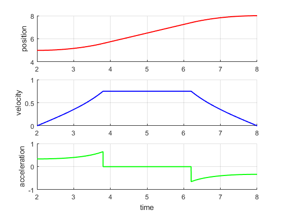

## 基本轨迹合成--线性轨迹的圆弧过渡

匀速的轨迹在实际中是无法应用的，因为在轨迹的起始和结束段速度发生跳变，幅值无穷大。为了获得至少是速度连续的一个轨迹，方法很多，在起始端和结束加入圆弧过渡段就是一个方法。如下图所示，圆弧的半径等于位移$h=q_1-q_0$,圆心分别在$(0,h), (T,0)$,其中$T=t_1-t_0$.


这样轨迹被分为加速段，匀速段和减速段，加速段和减速段时间间隔相等，如图所示$T_a=h\text {sin}(\alpha)$，$\alpha$在下面会定义。轨迹可以通过下面的方程描述

（1）$t_0<t<t_0+T_a$
$$
\begin{cases}
q_a(t)=h(1-\sqrt {1-\frac{(t-t_0)^2}{h^2}})+q_0 \\
\dot q_a(t)=\frac{t-t_0}{\sqrt{h^2-(t-t_0)^2}}\\
\ddot q_a(t)=\frac{h^2}{\sqrt{[h^2-(t-t_0)^2]^3}}
\end{cases}
$$
(2)$t_0+T_a\leq t\leq t_1-T_a$
$$
\begin{cases}
q_b(t)=a_0+a_1(t-t_0)\\
\dot q_b(t)=a_1\\
\ddot q_b(t)=0
\end{cases}
$$
(3)$t_1-T_a\leq t <t_1$
$$
\begin{cases}
q_c(t)=q_0+\sqrt{h^2-(t-t_0)^2}\\
\dot q_c(t)=\frac{t_1-t}{\sqrt{h^2-(t_1-t)^2}}\\
\ddot q_c(t)=-\frac{h^2}{\sqrt{[h^2-(t_1-t)^2]^3}}
\end{cases}
$$
根据在$t=t_a=t_0+T_a$处位移和速度的连续性条件确定参数$a_0,a_1$.
$$
\begin{cases}
q_a(t_a)=q_b(t_a)\\
\dot q_a(t_a)=\dot q_b(t_a)
\end{cases}
,t_a=t_0+T_a
$$
由条件1有
$$
a_1=\frac{h\text {sin}(\alpha)}{\sqrt{h^2-h^2\text {sin}(\alpha)}}=\text {tan}(\alpha)
$$
由条件2有
$$
h\left (1-\sqrt{1-\frac{h^2\text{sin}^2\alpha}{h^2}}\right )+q_0=a_0+h\text{tan}\alpha\text {sin}\alpha
$$
整理可得
$$
a_0=h\frac{\text {cos}\alpha -1}{\text{cos}\alpha}+q_0
$$
根据图中轨迹的几何关系由
$$
\text{tan}\alpha=\frac{h-2h(1-\text{cos}\alpha)}{T-2h\text{sin}\alpha}
$$
只考虑区间$[0,\pi/2]$上的解，有
$$
\alpha=\text{arccos}\frac{2h^2+T\sqrt{T^2-2h^2}}{h^2+T^2}
$$
注意，这里假设圆弧的半径等于位移$h$，因此运动时间$T$必须满足下面的约束
$$
T\geq\sqrt{3}h=\sqrt{3}(q_1-q_0)
$$
下面举一个例子，利用上面的结果来确定一条轨迹的方程。

example3.1: $t_0=2,t_1=8,q_0=5,q_1=8$,绘制出该条件下的圆弧过渡的轨迹。

matlab实现代码如下

```matlab
%{
使用圆弧过渡线性轨迹,example3.1
LiBing
2018-12-21,
%}
close('all')
clc
clear
%%
%已知轨迹给定条件
t0=2;
t1=8;
q0=5;
q1=8;
%%
%根据公式计算轨迹方程的参数
T=t1-t0;
h=q1-q0;
Ts=0.001;
alpha=acos((2.0*h*h+T*sqrt(T*T-3.0*h*h))/(h*h+T*T));
a0=q0+h*(cos(alpha)-1)/cos(alpha);
a1=tan(alpha);
Ta=h*sin(alpha);
i=1;
for t=t0:Ts:t1
    time(i)=t;
    if(t>=t0 &&t<t0+Ta)
         q(i)=h*(1.0-sqrt(1.0-(t-t0)^2/h^2))+q0;
         dq(i)=(t-t0)/sqrt(h^2-(t-t0)^2);
         ddq(i)=h^2/sqrt((h^2-(t-t0)^2)^3);
    end
     if(t>=t0+Ta && t<t1-Ta)
         q(i)=a0+a1*(t-t0);
         dq(i)=a1;
         ddq(i)=0;    
        end
     if(t>=t1-Ta&& t<=t1)
         q(i)=q0+sqrt(h^2-(t1-t)^2);
         dq(i)=(t1-t)/sqrt(h^2-(t1-t)^2);
         ddq(i)=h^2/sqrt((h^2-(t1-t)^2)^3);
       end  
       i=i+1;   
end
%%
%设置绘图格局
figure
fig1=subplot(3,1,1);
ylabel('position');
grid on
hold on
fig2=subplot(3,1,2);
ylabel('velocity');
grid on
hold on
fig3=subplot(3,1,3);
ylabel('acceleration');
xlabel('time');
grid on
hold on
%绘图
c1=plot(fig1,time,q,'-r','LineWidth',1.5);
c2=plot(fig2,time,dq,'-b','LineWidth',1.5);
c3=plot(fig3,time,ddq,'-g','LineWidth',1.5);
%end
```

代码运行果如下图所示



##小结

在运动控制领域最常用的轨迹是梯形速度曲线和S型速度曲线。接下来将继续研究抛物线过渡（梯形速度曲线）的轨迹，多项式过渡（S型速度曲线）的轨迹。

参考文献

[1]Biagiotti L, Melchiorri C. Trajectory Planning for Automatic Machines and Robots[M]. Springer Berlin Heidelberg, 2009.